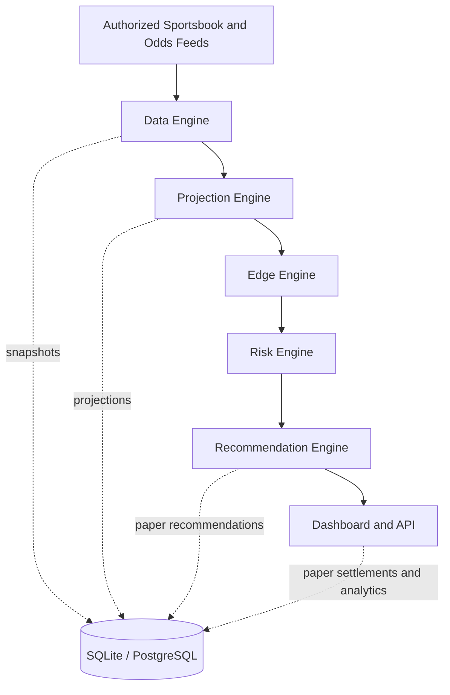
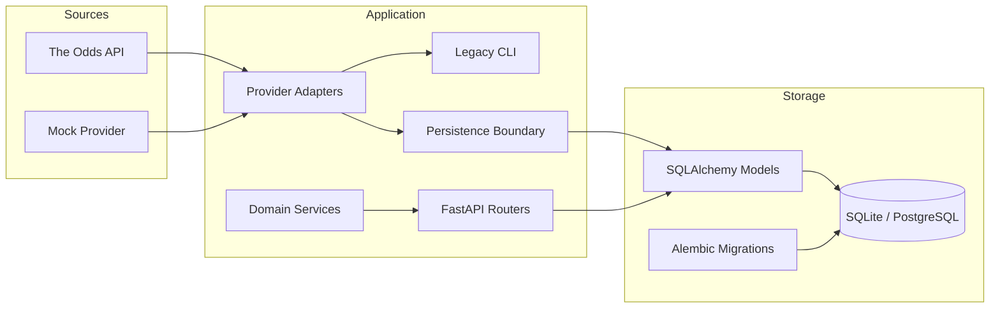

# EDGE IQ architecture

EDGE IQ is designed as a layered, local-first analytics platform. Feed ingestion,
projection logic, market comparison, risk policy, recommendations, and presentation
remain separate so each layer can evolve independently.

## Product pipeline



No layer logs into a sportsbook, scrapes restricted sites, or places wagers.

## Current v0.3 modules



## Request and recommendation flow

```mermaid
sequenceDiagram
    participant Client
    participant API
    participant Lines as Best-Line Service
    participant Model as Projection Service
    participant Risk as Confidence / Risk Policy
    participant DB

    Client->>API: Submit model probability and confidence inputs
    API->>DB: Load eligible market offers
    API->>Lines: Select threshold-first best offer
    Lines-->>API: Offer and selection reason
    API->>Model: Calculate probability and expected return
    API->>Risk: Apply confidence, freshness, and exposure thresholds
    Risk-->>API: PASS / WATCH / BET plus reasons
    API->>DB: Store projection and paper recommendation
    API-->>Client: Typed response; no wager execution
```

## Repository boundaries

```text
app/
|-- providers/       Authorized and mock odds-feed adapters
|-- services/        Projection, confidence, EV, CLV, and risk rules
|-- api.py           Prop, projection, and recommendation endpoints
|-- paper_api.py     Paper-bet lifecycle and analytics endpoints
|-- schemas.py       Pydantic v2 API contracts
|-- db_models.py     SQLAlchemy 2.x models
|-- database.py      Engine and session configuration
`-- main.py          FastAPI composition root

alembic/             Versioned database migrations
tests/               Unit, persistence, migration-adjacent, and endpoint tests
data/                Ignored local runtime data; only .gitkeep is tracked
```

Providers return normalized Pydantic offers and do not depend on SQLAlchemy. Domain
services are deterministic and independently testable. API modules coordinate those
services and persistence. Configuration and secrets enter through environment
variables and `pydantic-settings`.

SQLite is the local default. Portable SQLAlchemy types and migration discipline keep
PostgreSQL adoption straightforward, though PostgreSQL must receive its own CI matrix
before production use.

## Engineering principles

- Paper-only decisions until legal, security, operational, and product requirements
  explicitly authorize another mode.
- Licensed or authorized data sources only.
- Reproducible calculations with documented formulas and timestamps.
- Financial values stored with decimal precision.
- Backward-compatible APIs and forward-only production migrations.
- Tests and migrations required before merge.
- No unsupported claims about model quality or profitability.
