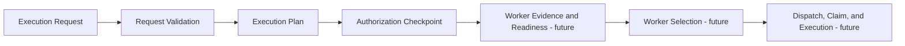
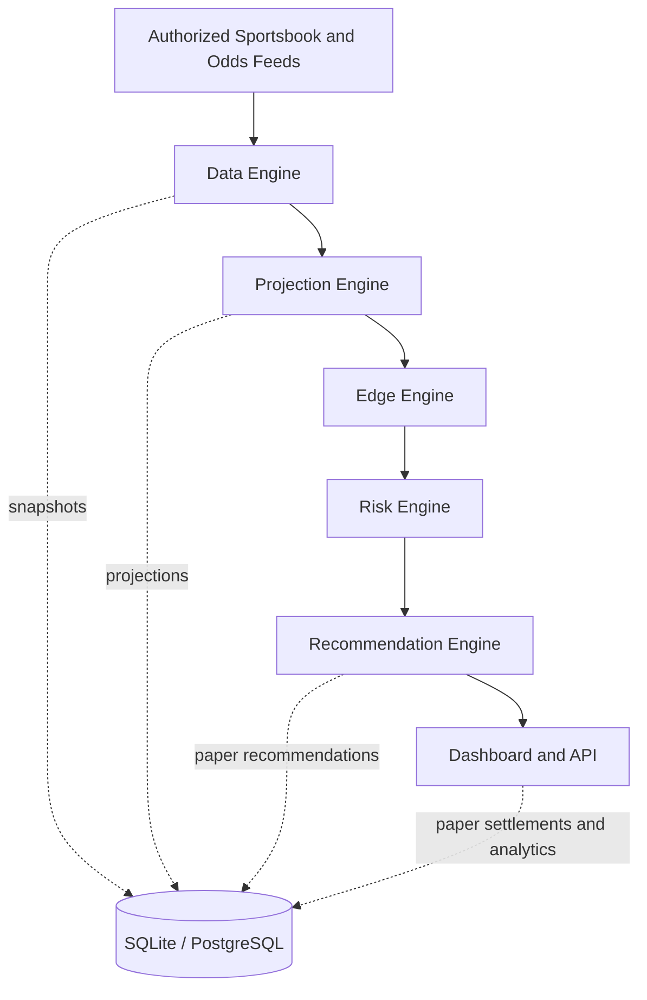
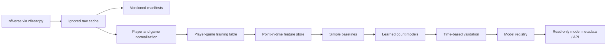
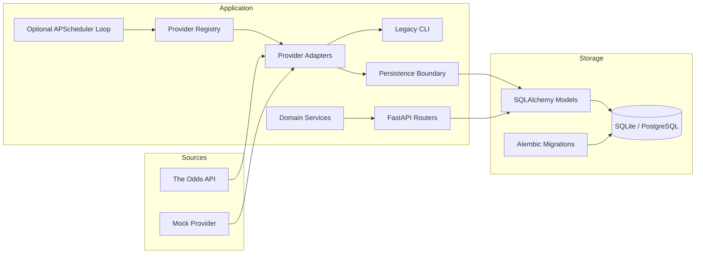

# EDGE IQ architecture

EDGE IQ is designed as a layered, local-first analytics platform. Feed ingestion,
projection logic, market comparison, risk policy, recommendations, and presentation
remain separate so each layer can evolve independently.

## Governing runtime baseline

Future runtime features are governed by
[Runtime Architecture Baseline v1](docs/runtime/RUNTIME_ARCHITECTURE_BASELINE_V1.md)
and [ADR 0007](docs/decisions/0007-runtime-architecture-baseline-v1.md). The baseline
requires single semantic ownership, append-only history, deterministic replay,
compare-and-swap concurrency, fail-closed security boundaries, and dependencies only
on preceding authoritative artifacts.



This diagram names conceptual roles, not implemented modules. Worker Selection and
all downstream runtime behavior remain deferred. Each future runtime proposal must
pass the [Architecture Review Gate](docs/runtime/ARCHITECTURE_REVIEW_GATE.md) before
implementation is authorized.

## Product pipeline



No layer logs into a sportsbook, scrapes restricted sites, or places wagers.

## v0.5 research pipeline



The stages are promotion gates, not one combined build. v0.5A ends at the training
table. v0.5B computes versioned point-in-time candidates, baseline evaluation begins in v0.5C, and
learned models in v0.5D.

v0.5B separates identifiers, metadata, enabled feature candidates, and the target.
All outcome-derived histories are updated only after a complete game is
materialized. Stable player IDs preserve history through trades. Player rolling
history carries across seasons; season-to-date, team, and opponent histories reset.
The canonical content hash is the durable table identity, while a Parquet hash
identifies exact bytes for the pinned Polars environment.

Calibration error is the primary model-quality KPI. ROI and win percentage are not
model-promotion metrics. No model artifact becomes eligible for production use
without a reproducible dataset, point-in-time feature audit, chronological holdout,
and calibration report.

## Current application modules



## Request and recommendation flow

```mermaid
sequenceDiagram
    participant Client
    participant API
    participant Lines as Best-Line Service
    participant Model as Projection Service
    participant Risk as Confidence / Risk Policy
    participant DB

    Client->>API: Submit model probability and confidence inputs
    API->>DB: Load eligible market offers
    API->>Lines: Select threshold-first best offer
    Lines-->>API: Offer and selection reason
    API->>Model: Calculate probability and expected return
    API->>Risk: Apply confidence, freshness, and exposure thresholds
    Risk-->>API: PASS / WATCH / BET plus reasons
    API->>DB: Store projection and paper recommendation
    API-->>Client: Typed response; no wager execution
```

## Repository boundaries

```text
app/
|-- research/        Historical-data and point-in-time feature contracts
|-- providers/       Authorized and mock odds-feed adapters
|-- services/        Projection, confidence, EV, CLV, and risk rules
|-- api.py           Prop, projection, and recommendation endpoints
|-- paper_api.py     Paper-bet lifecycle and analytics endpoints
|-- schemas.py       Pydantic v2 API contracts
|-- db_models.py     SQLAlchemy 2.x models
|-- database.py      Engine and session configuration
`-- main.py          FastAPI composition root

alembic/             Versioned database migrations
feature_store/       Typed candidate definitions, missing policies, and leakage decisions
model_registry/      Versioned model metadata; generated artifacts remain ignored
docs/decisions/      Architecture Decision Records (ADRs)
tests/               Unit, persistence, migration-adjacent, and endpoint tests
data/                Ignored local runtime data; only .gitkeep is tracked
```

Providers return normalized Pydantic offers and do not depend on SQLAlchemy. Domain
services are deterministic and independently testable. API modules coordinate those
services and persistence. Configuration and secrets enter through environment
variables and `pydantic-settings`.

SQLite is the local default. Portable SQLAlchemy types and migration discipline keep
PostgreSQL adoption straightforward, though PostgreSQL must receive its own CI matrix
before production use.

The legacy local `data/edgeiq.db` is not assumed to be revision-stamped. It must not
be stamped or mutated as part of v0.5A; clean-database Alembic validation is used
instead. Reconciliation is deferred to a dedicated migration decision documented in
[`docs/database-migrations.md`](docs/database-migrations.md).

## Engineering principles

- Paper-only decisions until legal, security, operational, and product requirements
  explicitly authorize another mode.
- Licensed or authorized data sources only.
- Reproducible calculations with documented formulas and timestamps.
- Financial values stored with decimal precision.
- Backward-compatible APIs and forward-only production migrations.
- Tests and migrations required before merge.
- No unsupported claims about model quality or profitability.
- Immutable, deterministic, evidence-backed contracts for future runtime decisions.
- Architecture Review Gate approval before any future runtime implementation.
