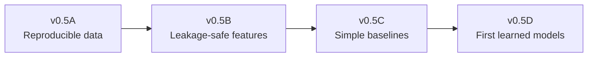

# EDGE IQ roadmap

This roadmap communicates product direction, not fixed delivery dates. Model
complexity is earned through reproducibility and held-out evidence.

| Release | Theme | Status |
| --- | --- | --- |
| v0.1 | Line Shopping | Complete |
| v0.2 | API and Database | Complete |
| v0.3 | Projection Quality and Paper Trading | Complete |
| v0.4 | Automated Data Engine | Complete |
| v0.5A | Reproducible Data Pipeline | In progress — highest priority |
| v0.5B | WR Feature Engineering | Blocked by v0.5A |
| v0.5C | Baseline Models | Blocked by v0.5B |
| v0.5D | First ML Models | Blocked by v0.5C |
| v0.6 | Expanded Intelligence | Planned |
| v0.7 | Dashboard | Planned |
| v1.0 | Public Beta | Planned |

## v0.5 promotion sequence

### v0.5A — Reproducible Data Pipeline

Build the `nflreadpy`/nflverse adapter, ignored local cache, source manifests,
canonical player mapping, tiny offline fixtures, and one-row-per-WR-game training
table generator. The milestone exits only when the same inputs and configuration
regenerate identical dataset and manifest hashes while retaining capture timestamps.

### v0.5B — WR Feature Engineering

Build the shared feature store. Every candidate feature records its source,
lookback, point-in-time availability, leakage risk, formula, missing-data policy,
and Keep/Modify/Discard decision. Same-game outcome information is prohibited.

### v0.5C — Baseline Models

Evaluate previous-game, rolling three-game, rolling five-game, season-to-date, and
Poisson opportunity baselines on chronological held-out data. Calibration error is
the primary probability metric. A learned model is not justified until these
baselines are stable and reproducible.

### v0.5D — First ML Models

Evaluate Poisson regression, negative-binomial regression, and Ridge regression
against the v0.5C baselines with expanding-time validation. No neural networks.
Promotion requires a meaningful held-out improvement and acceptable calibration,
not a favorable in-sample result.

## Later releases

- v0.6 expands only validated model families and consumers.
- v0.7 adds research, calibration, feature, and paper-performance dashboards.
- v1.0 completes stable API, security, licensing, PostgreSQL, and operations work.

## Release discipline

- Version data, feature definitions, model metadata, and experiment decisions.
- Keep raw data, processed datasets, and model artifacts out of Git.
- Use licensed or authorized sources and preserve their attribution.
- Use chronological validation; never random-split player-game rows.
- Treat calibration error as the primary dashboard model-quality measure.
- Keep all recommendations paper-only and make no profitability claims.
- Require passing tests, compilation, migration, and schema-drift checks before merge.
