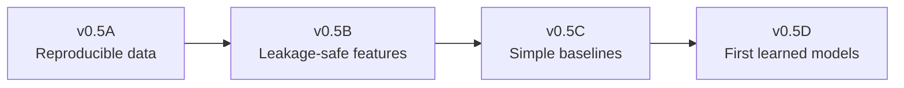

# EDGE IQ roadmap

This roadmap communicates product direction, not fixed delivery dates. Model
complexity is earned through reproducibility and held-out evidence.

| Release | Theme | Status |
| --- | --- | --- |
| v0.1 | Line Shopping | Complete |
| v0.2 | API and Database | Complete |
| v0.3 | Projection Quality and Paper Trading | Complete |
| v0.4 | Automated Data Engine | Complete |
| v0.5A | Reproducible Data Pipeline | Complete |
| v0.5B | WR Feature Engineering | Complete |
| v0.5C | Baseline Models | Complete |
| v0.5D | First ML Models | Partially delivered; superseded by v0.6A/v0.6B |
| v0.6A | Deterministic WR Poisson Model | Complete |
| v0.6B | Rolling Evaluation and Diagnostics | Complete |
| v0.7A | Runtime Architecture Baseline v1 | Complete |
| v0.8 | Worker Selection Foundation | Complete |
| v0.9A | Execution Request Foundation | Complete |
| v0.9B | Immutable Execution Plan Foundation | Complete |
| v0.10A | Dispatch Decision Foundation | Complete |
| v0.10B | Work Claim Foundation | Draft authorization candidate; ineffective until PR #28 merges |
| v1.0 | Public Beta | Planned |

## v0.5 promotion sequence


```mermaid
flowchart LR
    A[v0.5A<br/>Reproducible data] --> B[v0.5B<br/>Leakage-safe features]
    B --> C[v0.5C<br/>Simple baselines]
    C --> D[v0.5D<br/>First learned models]
```

### v0.5A — Reproducible Data Pipeline

Build the `nflreadpy`/nflverse adapter, ignored local cache, source manifests,
canonical player mapping, tiny offline fixtures, and one-row-per-WR-game training
table generator. The milestone exits only when the same inputs and configuration
regenerate identical dataset and manifest hashes while retaining capture timestamps.

### v0.5B — WR Feature Engineering

Build the shared feature store. Every candidate feature records its source,
lookback, point-in-time availability, leakage risk, formula, missing-data policy,
and future Keep/Modify/Discard decision. Same-game outcome information is prohibited.
Implementation creates candidates and audits only; no feature is promoted before
v0.5C/v0.5D evidence.

### v0.5C — Baseline Models

Evaluate previous-game, rolling three-game, rolling five-game, season-to-date, and
Poisson opportunity baselines on chronological held-out data. MAE is the primary
error metric and the metric used to select the strongest eligible baseline.
Calibration error and Poisson deviance are separate promotion-critical metrics. A
learned model is not justified until these baselines are stable and reproducible.

### v0.5D — First ML Models (partially delivered and superseded)

The original v0.5D scope proposed Poisson regression, Negative Binomial regression,
and Ridge regression against v0.5C baselines with expanding-time validation.

Poisson regression was delivered under v0.6A. Expanding-window evaluation,
paired-bootstrap comparisons, and diagnostic reporting were delivered under v0.6B.
Negative Binomial and Ridge models remain unimplemented. No automatic model
promotion is authorized; learned models remain governed research candidates.

## Later releases

- v0.6 delivered the first deterministic learned WR model and its rolling evaluation
  and diagnostic infrastructure.
- v0.7A published Runtime Architecture Baseline v1 as the governing runtime
  architecture.
- v0.8 delivered Worker Selection Foundation as deterministic, explainable candidate
  ordering with process-local reference history. Durable distributed persistence and
  downstream runtime effects remain deferred.
- ADR 0009 defines the proposed Execution Request and Deterministic Planning
  Foundation. Its Architecture Review Gate passed. A separate authorization permits
  the completed v0.9A Execution Request Foundation slice and a later, separately
  bounded authorization permits only the v0.9B immutable Execution Plan foundation
  implementation candidate.
- ADR 0010 remains Proposed and constrains v0.9B to the effective runtime dependency,
  transition-ownership, immutable-evidence, reconstruction, concurrency, and
  fail-closed boundaries. It authorizes no implementation by itself.
- ADR 0011 defines the Proposed Dispatch Decision Foundation. Its Architecture
  Review Gate passed. The separately authorized bounded v0.10A immutable Dispatch
  Decision foundation passed its Implementation Review Gate and was merged.
- ADR 0012 defines the Proposed Work Claim Foundation and its Architecture Review
  Gate passed. Draft PR #28 is an unmerged authorization candidate; authorization is
  ineffective until that PR merges into `main`. Work Claim implementation has not
  started, v0.10B is not implemented, and Execution Attempt and every later effect
  remain deferred.
- v1.0 and later items remain future planning. Release labels do not establish or
  substitute for the objective Prototype acceptance criteria below.

## Prototype Acceptance Criteria

EDGEIQ qualifies as a **Prototype** only when every criterion below is satisfied by
independently reproducible automated validation:

1. **Task submission:** a documented API accepts a versioned immutable demonstration
   workload, returns a canonical workload identity, and enforces scoped idempotency,
   including conflict behavior for key reuse with different content.
2. **Deterministic planning:** the accepted workload produces an immutable Execution
   Plan whose identifier, hash, and contents reproduce from identical retained
   inputs; invalid or unsupported requirements fail closed.
3. **Authoritative worker evidence:** Worker Identity and Worker Readiness have
   explicit owners and produce retained, organization-scoped evidence. Selection
   does not rely on unverified caller assertions.
4. **Selection integration:** Worker Selection consumes retained plan and readiness
   artifacts and deterministically reproduces its outcome, scores, ordering,
   identifiers, and hashes.
5. **Bounded dispatch and claim:** a selected work item can be offered through an
   explicit dispatch decision, and concurrency validation proves that no more than
   one active claim exists for one work item and claim generation.
6. **Demonstration execution:** one allowlisted deterministic handler executes only
   with the required authority and valid claim, without external network access.
7. **Completion:** successful and failed attempts produce immutable terminal records
   that cannot be silently returned to a nonterminal state.
8. **Durability:** requests, plans, worker evidence, selections, dispatch decisions,
   claims, attempts, and completion history survive application restart; current
   projections can be rebuilt from that history.
9. **Replay:** a documented command or API reconstructs deterministic decisions from
   retained artifacts without live provider or worker lookup and fails explicitly on
   missing evidence, unsupported versions, or hash divergence.
10. **Isolation and failures:** automated tests prove organization isolation and
    stable machine-readable failures for invalid submission, unavailable evidence,
    no eligible workers, stale writes, duplicate or expired claims, handler failure,
    persistence failure, and replay divergence.
11. **Traceability:** one correlation identifier spans request, plan, selection,
    dispatch, claim, attempt, and completion, and structured logs expose safe reason
    codes without secrets or sensitive evidence.
12. **Repeatable demonstration:** documented clean-state commands start the
    application, submit and complete the demonstration workload, retrieve its
    history, and verify replay; the complete Prototype suite passes in CI without
    external network access.

Partial fulfillment is roadmap progress, not Prototype completion.

## Authorized runtime milestone

### v0.9A — Execution Request Foundation

This is the smallest authorized runtime slice supplying the first authoritative
upstream artifact expected by later deterministic planning:

```text
Request Intake -> Execution Request admission
```

The authorized slice defines immutable accepted-request contracts; deterministic
canonical serialization, hashes, and identifiers; scoped idempotency; atomic,
concurrency-safe admission; stable failure behavior; and fail-closed reconstruction
from retained canonical content.

It does not implement Execution Plans or deterministic planning. It also does not
select workers, schedule, dispatch, claim, lease, execute, retry, monitor,
orchestrate, invoke providers, or change worker identity or readiness ownership.

ADR 0009 remains Proposed. The request-only slice received a separate explicit
implementation authorization after its Architecture Review Gate passed. That
authorization does not extend to deterministic planning or downstream runtime
behavior.

Any deterministic planning beyond the bounded v0.9B candidate requires its own
separate explicit authorization. No additional implementation may begin by
implication from this roadmap.

### v0.9B — Immutable Execution Plan Foundation

The separately authorized implementation candidate is limited to:

```text
Accepted Execution Request + retained valid Request Validation evidence
    -> registered versioned planning rule
    -> Immutable deterministic Execution Plan
```

The candidate defines immutable plan contracts; deterministic derivation owned by a
registered versioned planning rule consuming retained accepted request and Request
Validation evidence plus immutable policy/configuration inputs; canonical input and
plan serialization, digests, and identities; exact planning-rule, policy,
configuration, and schema versions; append-only process-local reference history;
scoped idempotency; expected-version compare-and-swap; atomic publication; and
fail-closed reconstruction.

The candidate remains subject to Implementation Review Gate, CI, and merge review.
It is not complete and does not make ADR 0009 or ADR 0010 Accepted.

It does not implement or change Worker Readiness, Worker Selection, Authorization
Checkpoint, leases, queues, dispatch, claims, attempts, execution, monitoring,
completion, retries, scheduling, orchestration, providers, models, or external side
effects. Those capabilities remain unauthorized.

### v0.10A — Dispatch Decision Foundation

The separately authorized implementation candidate is limited to:

```text
Immutable Execution Plan + retained Worker Selection evidence
    + retained Execution Lease evidence + exact Dispatch policy
    -> immutable Dispatch approval or denial evidence
```

The candidate defines immutable Dispatch Decision contracts; canonical serialization,
digests, and deterministic identities; a candidate-specific aggregate stream;
append-only process-local reference history; scoped idempotency; expected-version
compare-and-swap; organization-isolated retrieval; and deterministic fail-closed
reconstruction.

Approval creates no claim, exclusivity, lease, queue message, execution, or external
effect. The candidate does not implement or change Authorization Checkpoint,
Execution Lease, Worker Readiness, Worker Selection, Work Claim, Queue Envelope,
execution, monitoring, completion, retries, scheduling, orchestration, APIs,
migrations, providers, models, or durable distributed persistence.

ADR 0011 remains Proposed. The candidate remains subject to an Implementation Review
Gate, CI, and merge review. No downstream runtime capability or later milestone is
authorized by this roadmap entry.

The v0.10A candidate passed its final Implementation Review Gate and CI and was
squash-merged through PR #26. Work Claim, Queue Envelope, execution, and later
milestones were not authorized by that merge.

### v0.10B — Work Claim Foundation

ADR 0012 is the sole architectural basis for this candidate and remains Proposed;
ADRs 0007–0011 remain controlling. ADR 0012's Architecture Review Gate passed, but
its publication, architectural review, and merge did not authorize implementation.

PR #28 is Draft and unmerged. Authorization is not currently effective. Opening the
PR, CI passing, a Governance Review Gate `PASS`, marking the PR Ready, or adding a
governance comment does not authorize implementation. Authorization becomes
effective only when PR #28 is merged into `main`. Until that merge, Work Claim
implementation remains prohibited and has not started; v0.10B is not implemented.

The authorized slice is limited to:

```text
Applicable approved Dispatch Decision + authenticated claimant evidence
    + exact claim policy + expected lineage version
    -> immutable Work Claim evidence
```

If and only if PR #28 merges, implementation may include only:

- immutable Work Claim lineage events and records;
- canonical UTF-8 serialization, deterministic identities, and canonical digests;
- one authoritative work-item lineage stream keyed only by `organization_id`,
  `workload_context_id`, `plan_id`, and `work_item_id`;
- lineage stream version ordering every lifecycle event;
- owner-assigned monotonic claim generation stored as immutable event content, with
  one unique next generation under expected-version CAS and later generation only
  after valid expiry or release;
- acceptance-only monotonic fencing across the entire lineage, strictly separate from
  lineage version and generation;
- append-only acceptance, retained rejection, expiry, and release evidence;
- scoped idempotency and expected-version CAS;
- rollback-safe owner-scoped atomic publication;
- deterministic reconstruction and fail-closed validation;
- organization and workload isolation;
- bounded focused unit tests; and
- bounded implementation documentation.

Generation, claimant identity, candidate identity, and Dispatch identity are
canonical transition inputs and never lineage identity. Competing claimants and
candidate-specific Dispatch approvals share one exclusivity lineage. All lifecycle
transitions serialize through one lineage CAS boundary. Only one successor commits at
one expected lineage version; stale writers append nothing and reload. There is no
cross-stream atomicity, timestamp arbitration, last-write-wins, caller-selected or
timestamp-derived generation, or timestamp-derived fence. Only accepted claims
advance the fence. Rejection, expiry, release, and generation creation neither become
nor reuse fences, and every later accepted claim has a fence greater than every
earlier accepted claim.

One approved Dispatch Decision is the direct upstream semantic input. Work Claim may
resolve or reconstruct it only for identity, digest, scope, approval, applicability,
and causal-integrity verification. Plan, selection, readiness, Authorization
Checkpoint, and Execution Lease semantics remain upstream-owned. Work Claim cannot
re-evaluate Dispatch policy, re-authorize, recompute readiness, rerank candidates, or
grant, renew, revoke, extend, or reinterpret a lease. Newer Dispatch evidence alone
cannot supersede an active claim or create another generation.

Claimant implementation is limited to a narrow retained evidence contract containing
authenticated claimant identity, selected-candidate equivalence,
organization/workload scope, evidence identity and digest, supported schema/version,
and applicability to the approved Dispatch offer. Work Claim verifies retained
evidence only; it cannot create or change Worker Identity semantics, authentication
infrastructure, trust, health, readiness, authorization, or general identity systems.

Complete authoritative evidence may produce only immutable accepted, retained
rejected, expired, or released outcomes. Malformed input; missing or inaccessible
evidence; unsupported schema, policy, component, or serialization versions; digest or
organization/workload mismatch; claimant/candidate mismatch caused by invalid
evidence; idempotency or expected-version conflict; illegal lineage transition;
duplicate or skipped generation; non-monotonic or reused fence; persistence or
reconstruction failure; replay divergence; and internal failure are explicit
fail-closed failures, never acceptance or rejection outcomes.

Reconstruction consumes complete authoritative lineage history with contiguous
versions; exact approved Dispatch and claimant evidence; exact claim-policy identity,
version, and digest; generation assignments; acceptance fences; expiry/release and
semantic-time evidence; and exact schema, component, serialization, and configuration
versions. It reproduces generation boundaries, accepted claimant, lifecycle outcomes,
current derived claim, next permitted generation, all fences, canonical input,
identity, content, and digest. It rejects lineage gaps; skipped/duplicate generations;
multiple acceptances in one generation; generation before prior termination;
duplicate/non-monotonic fences; missing/altered upstream evidence; policy divergence;
and canonical-content divergence. Replay uses no current time, live worker state,
queues, authoritative projections, providers, execution results, ambient mutable
configuration, or external systems.

One owner-scoped atomic publication contains only one immutable lineage event, the
lineage-history update, a repository-owned derived pointer/index, generation and fence
assignments when applicable, and the idempotency index entry. Preparation precedes
one logical commit. Failure exposes no partial event, generation, fence, history
entry, ID index, idempotency entry, or current pointer; previously accepted
state remains unchanged. It cannot atomically create or mutate Dispatch Decision,
Execution Lease, Queue Envelope, Execution Attempt, Completion Evidence, or external
effects.

Reads and writes are organization-scoped; lineage is workload-scoped; idempotency is
organization-scoped; and Dispatch, claimant, and policy evidence lookup is
scope-aware. Absent and inaccessible foreign evidence expose the same safe failure
class, code, message, and publication behavior, without foreign artifact-existence
disclosure. Same-scope integrity failures remain explicit. Claimant evidence is
non-substitutable across organization/workload scope, and scope-safe lookup failure
publishes no accepted state.

This candidate explicitly excludes Execution Attempt; execution; worker invocation;
monitoring; completion; retries; Dispatch, Worker Selection, Worker Readiness,
Execution Lease, Authorization Checkpoint, or Worker Identity semantic changes;
authentication-system expansion; Queue Envelope; queue publication or consumption;
provider or model invocation; orchestration; scheduling; public APIs; routes;
controllers; migrations; external effects; durable distributed persistence;
background workers; any end-to-end runtime path; and every later milestone.

Bounded tests may cover only lineage identity; unique generation; one acceptance per
generation; monotonic fencing; expiry/release; equivalent and conflicting
idempotency; stale expected versions; claimant, claim/release, and claim/expiry races;
atomic failure and prior-state preservation; reconstruction and divergence;
organization/workload isolation; absent-versus-foreign non-disclosure; and downstream
exclusions. They cannot require Execution Attempt, queues, execution, monitoring,
completion, retries, orchestration, or external integrations.

After authorization becomes effective, a future implementation PR must stay within
this exact slice and pass a full Implementation Review Gate, CI, and merge review.
Material deviation requires an amended or new ADR, another Architecture Review Gate
where applicable, and separate implementation authorization. This candidate does not
make ADR 0012 Accepted, authorize a later milestone, establish an end-to-end runtime
path or prototype, or grant execution authority.

## Roadmap governance

`ROADMAP.md` records planned sequencing and acceptance targets. A Draft authorization
candidate recorded here is ineffective until its authorizing PR merges into `main`.
The roadmap does not approve architecture, supersede ADRs, or make authorization
effective through publication, CI, review, comments, or Ready status.

New architectural capability requires an accepted ADR and a successful Architecture
Review Gate. Implementation begins only after a separate explicit authorization
decision. Material deviation from an accepted design returns to architectural
governance before implementation continues.

## Release discipline

- Version data, feature definitions, model metadata, and experiment decisions.
- Keep raw data, processed datasets, and model artifacts out of Git.
- Use licensed or authorized sources and preserve their attribution.
- Use chronological validation; never random-split player-game rows.
- Use MAE as the primary error and baseline-selection metric; treat calibration error
  and Poisson deviance as separate promotion-critical metrics.
- Keep all recommendations paper-only and make no profitability claims.
- Require passing tests, compilation, migration, and schema-drift checks before merge.
