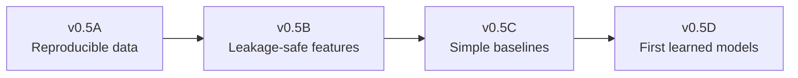

# EDGE IQ roadmap

This roadmap communicates product direction, not fixed delivery dates. Model
complexity is earned through reproducibility and held-out evidence.

| Release | Theme | Status |
| --- | --- | --- |
| v0.1 | Line Shopping | Complete |
| v0.2 | API and Database | Complete |
| v0.3 | Projection Quality and Paper Trading | Complete |
| v0.4 | Automated Data Engine | Complete |
| v0.5A | Reproducible Data Pipeline | Complete |
| v0.5B | WR Feature Engineering | Complete |
| v0.5C | Baseline Models | Complete |
| v0.5D | First ML Models | Partially delivered; superseded by v0.6A/v0.6B |
| v0.6A | Deterministic WR Poisson Model | Complete |
| v0.6B | Rolling Evaluation and Diagnostics | Complete |
| v0.7A | Runtime Architecture Baseline v1 | Complete |
| v0.8 | Worker Selection Foundation | Complete |
| Next runtime milestone | Execution Request and Deterministic Planning Foundation | Proposed; planning only |
| v1.0 | Public Beta | Planned |

## v0.5 promotion sequence


```mermaid
flowchart LR
    A[v0.5A<br/>Reproducible data] --> B[v0.5B<br/>Leakage-safe features]
    B --> C[v0.5C<br/>Simple baselines]
    C --> D[v0.5D<br/>First learned models]
```

### v0.5A — Reproducible Data Pipeline

Build the `nflreadpy`/nflverse adapter, ignored local cache, source manifests,
canonical player mapping, tiny offline fixtures, and one-row-per-WR-game training
table generator. The milestone exits only when the same inputs and configuration
regenerate identical dataset and manifest hashes while retaining capture timestamps.

### v0.5B — WR Feature Engineering

Build the shared feature store. Every candidate feature records its source,
lookback, point-in-time availability, leakage risk, formula, missing-data policy,
and future Keep/Modify/Discard decision. Same-game outcome information is prohibited.
Implementation creates candidates and audits only; no feature is promoted before
v0.5C/v0.5D evidence.

### v0.5C — Baseline Models

Evaluate previous-game, rolling three-game, rolling five-game, season-to-date, and
Poisson opportunity baselines on chronological held-out data. MAE is the primary
error metric and the metric used to select the strongest eligible baseline.
Calibration error and Poisson deviance are separate promotion-critical metrics. A
learned model is not justified until these baselines are stable and reproducible.

### v0.5D — First ML Models (partially delivered and superseded)

The original v0.5D scope proposed Poisson regression, Negative Binomial regression,
and Ridge regression against v0.5C baselines with expanding-time validation.

Poisson regression was delivered under v0.6A. Expanding-window evaluation,
paired-bootstrap comparisons, and diagnostic reporting were delivered under v0.6B.
Negative Binomial and Ridge models remain unimplemented. No automatic model
promotion is authorized; learned models remain governed research candidates.

## Later releases

- v0.6 delivered the first deterministic learned WR model and its rolling evaluation
  and diagnostic infrastructure.
- v0.7A published Runtime Architecture Baseline v1 as the governing runtime
  architecture.
- v0.8 delivered Worker Selection Foundation as deterministic, explainable candidate
  ordering with process-local reference history. Durable distributed persistence and
  downstream runtime effects remain deferred.
- ADR 0009 defines the proposed Execution Request and Deterministic Planning
  Foundation. Its Architecture Review Gate passed. A separate authorization permits
  only the v0.9A Execution Request Foundation slice; deterministic planning remains
  unauthorized.
- v1.0 and later items remain future planning. Release labels do not establish or
  substitute for the objective Prototype acceptance criteria below.

## Prototype Acceptance Criteria

EDGEIQ qualifies as a **Prototype** only when every criterion below is satisfied by
independently reproducible automated validation:

1. **Task submission:** a documented API accepts a versioned immutable demonstration
   workload, returns a canonical workload identity, and enforces scoped idempotency,
   including conflict behavior for key reuse with different content.
2. **Deterministic planning:** the accepted workload produces an immutable Execution
   Plan whose identifier, hash, and contents reproduce from identical retained
   inputs; invalid or unsupported requirements fail closed.
3. **Authoritative worker evidence:** Worker Identity and Worker Readiness have
   explicit owners and produce retained, organization-scoped evidence. Selection
   does not rely on unverified caller assertions.
4. **Selection integration:** Worker Selection consumes retained plan and readiness
   artifacts and deterministically reproduces its outcome, scores, ordering,
   identifiers, and hashes.
5. **Bounded dispatch and claim:** a selected work item can be offered through an
   explicit dispatch decision, and concurrency validation proves that no more than
   one active claim exists for one work item and claim generation.
6. **Demonstration execution:** one allowlisted deterministic handler executes only
   with the required authority and valid claim, without external network access.
7. **Completion:** successful and failed attempts produce immutable terminal records
   that cannot be silently returned to a nonterminal state.
8. **Durability:** requests, plans, worker evidence, selections, dispatch decisions,
   claims, attempts, and completion history survive application restart; current
   projections can be rebuilt from that history.
9. **Replay:** a documented command or API reconstructs deterministic decisions from
   retained artifacts without live provider or worker lookup and fails explicitly on
   missing evidence, unsupported versions, or hash divergence.
10. **Isolation and failures:** automated tests prove organization isolation and
    stable machine-readable failures for invalid submission, unavailable evidence,
    no eligible workers, stale writes, duplicate or expired claims, handler failure,
    persistence failure, and replay divergence.
11. **Traceability:** one correlation identifier spans request, plan, selection,
    dispatch, claim, attempt, and completion, and structured logs expose safe reason
    codes without secrets or sensitive evidence.
12. **Repeatable demonstration:** documented clean-state commands start the
    application, submit and complete the demonstration workload, retrieve its
    history, and verify replay; the complete Prototype suite passes in CI without
    external network access.

Partial fulfillment is roadmap progress, not Prototype completion.

## Authorized runtime milestone

### v0.9A — Execution Request Foundation

This is the smallest authorized runtime slice supplying the first authoritative
upstream artifact expected by later deterministic planning:

```text
Request Intake -> Execution Request admission
```

The authorized slice defines immutable accepted-request contracts; deterministic
canonical serialization, hashes, and identifiers; scoped idempotency; atomic,
concurrency-safe admission; stable failure behavior; and fail-closed reconstruction
from retained canonical content.

It does not implement Execution Plans or deterministic planning. It also does not
select workers, schedule, dispatch, claim, lease, execute, retry, monitor,
orchestrate, invoke providers, or change worker identity or readiness ownership.

ADR 0009 remains Proposed. The request-only slice received a separate explicit
implementation authorization after its Architecture Review Gate passed. That
authorization does not extend to deterministic planning or downstream runtime
behavior.

Future implementation of deterministic planning requires its own separate explicit
authorization. No additional implementation may begin by implication from this
roadmap.

## Roadmap governance

`ROADMAP.md` records planned sequencing and acceptance targets. It does not authorize
implementation, approve architecture, or supersede accepted ADRs.

New architectural capability requires an accepted ADR and a successful Architecture
Review Gate. Implementation begins only after a separate explicit authorization
decision. Material deviation from an accepted design returns to architectural
governance before implementation continues.

## Release discipline

- Version data, feature definitions, model metadata, and experiment decisions.
- Keep raw data, processed datasets, and model artifacts out of Git.
- Use licensed or authorized sources and preserve their attribution.
- Use chronological validation; never random-split player-game rows.
- Use MAE as the primary error and baseline-selection metric; treat calibration error
  and Poisson deviance as separate promotion-critical metrics.
- Keep all recommendations paper-only and make no profitability claims.
- Require passing tests, compilation, migration, and schema-drift checks before merge.
