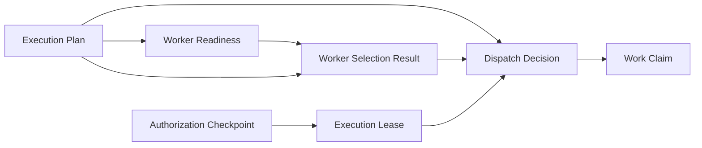

# ADR 0011: Dispatch Decision Foundation

Status: Proposed

## Context

[Runtime Architecture Baseline v1](../runtime/RUNTIME_ARCHITECTURE_BASELINE_V1.md)
requires one semantic owner for every authoritative decision and separates facts,
decisions, persisted intent, and external effects. The
[Runtime Component Map](../runtime/RUNTIME_COMPONENT_MAP.md) assigns Dispatch
Decision the decision to offer a work item to a selected candidate, while Worker
Selection owns candidate ordering and Work Claim owns bounded acceptance and
exclusivity.

ADR 0008 defines Worker Selection as deterministic ordering without dispatch. ADR
0009 preserves Dispatch Decision as a downstream owner. ADR 0010 records the
`dispatch approved or denied` transition and requires it to consume a Worker
Selection Result, applicable authority, and versioned dispatch policy without
recomputing selection or readiness.

That existing boundary is not yet precise enough for a future implementation. The
architecture must specify the direct authority artifact, readiness dependency,
freshness and supersession semantics, aggregate identity, idempotency scope,
immutable output, reconstruction inputs, and exact downstream boundary before code
may be considered.

This ADR is architecture documentation only. It authorizes no implementation.

## Decision

Define Dispatch Decision as the single semantic owner of:

> Whether one immutable planned-work item may be offered to one candidate identified
> by an immutable Worker Selection Result, under a valid retained Execution Lease
> and an exact versioned dispatch policy at one retained evaluation boundary.

Dispatch owns approval or denial of that offer only. It performs no external effect.

Dispatch does not own caller authorization, worker identity, trust, health,
readiness, ranking, selection, reservation, claim acceptance, claim exclusivity,
lease authority, queue transport, execution, monitoring, completion, retries,
scheduling, orchestration, or external effects.

## Dependency direction

The relevant partial order is:



The diagram records semantic dependencies, not a global transaction or required
deployment topology.

- Execution Plan never depends on Dispatch.
- Worker Readiness never depends on Dispatch.
- Worker Selection never depends on Dispatch.
- Execution Lease never depends on Dispatch.
- Dispatch cannot consume Work Claim or later runtime evidence.
- Work Claim may consume applicable approved Dispatch evidence.
- Downstream evidence never mutates an upstream artifact or decision.

## Authority input

Dispatch consumes one valid retained Execution Lease as its direct authority input.
The lease's immutable causal references retain the preceding Authorization
Checkpoint decision.

Dispatch may verify only:

- lease identity and canonical digest;
- organization and workload scope;
- planned-work applicability;
- supported schema and lease-policy versions;
- causal-reference integrity;
- the effective evidence boundary;
- expiry and revocation evidence; and
- bounded permission applicability to the proposed offer.

Dispatch must not re-evaluate authorization policy, reinterpret principal authority,
extend lease scope or duration, or grant, renew, revoke, replace, or transfer a
lease. A lease is not readiness, selection, claim, or execution evidence.

Missing, malformed, cross-scope, unsupported, or unverifiable lease evidence fails
closed without approval. Valid evidence showing expiry, revocation, or
inapplicability produces immutable denial evidence. Neither outcome creates
downstream authority.

## Readiness boundary

Dispatch directly consumes the immutable Worker Selection Result. Readiness evidence
is retained transitively through that result. Dispatch must not accept an
independently chosen readiness artifact that could be combined with an older
selection.

Dispatch may verify only:

- selection identity and canonical digest;
- referenced readiness identities and canonical digests;
- organization and workload scope;
- causal and evidence-boundary consistency;
- selected-candidate membership in the retained selection outcome; and
- freshness and applicability under the exact dispatch policy.

Dispatch must not recompute readiness, inspect live health or availability,
substitute newer readiness implicitly, or rerank candidates.

Missing, invalid, cross-scope, or unverifiable transitive readiness evidence fails
closed. Stale, expired, or superseded readiness produces a denial under the exact
dispatch policy. Newer readiness requires a new Worker Selection Result before a new
Dispatch evaluation.

## Freshness, time, and supersession

Ownership remains separated:

- Worker Readiness owns its evaluation boundary and readiness evidence.
- Worker Selection owns selection applicability and retained readiness references.
- Execution Lease owns permission scope, expiry, and revocation evidence.
- Dispatch policy owns only offer-time applicability predicates.
- Dispatch Decision owns the resulting approval or denial at its retained evaluation
  boundary.

Each evaluation retains:

- an immutable evaluation boundary;
- semantic effective time or equivalent immutable evaluation-time evidence;
- clock or time-source identity and version where time affects applicability;
- referenced upstream stream-version boundaries;
- exact policy, schema, component, serialization, and configuration versions; and
- a separate non-semantic recorded timestamp.

This ADR selects no concrete duration. Applicable durations and predicates belong to
explicitly versioned policies.

New readiness, selection, lease, revocation, policy, configuration, or evidence
boundaries produce new canonical evaluation input and a new immutable Dispatch
Decision. An earlier decision remains immutable historical evidence. A projection
may identify the latest applicable decision but owns no authority.

Replay uses retained evaluation-time evidence and never reads current time.

## Authoritative inputs

Dispatch consumes only:

- immutable Execution Plan identity and digest;
- immutable planned-work identity within that plan;
- immutable Worker Selection Result identity and digest;
- selected-candidate identity from that result;
- transitive Worker Readiness identities and digests retained by the selection;
- immutable Execution Lease identity and digest;
- the lease's causal Authorization Checkpoint reference;
- organization and workload context;
- dispatch-policy identity, version, and digest;
- exact schema, serialization, component, and canonical-configuration versions;
- explicit history or evidence boundary;
- immutable evaluation-time evidence;
- expected Dispatch stream version; and
- scoped idempotency identity.

Dispatch must not consume live worker state, live health or readiness, queue state,
mutable projections as authority, ambient mutable configuration, network responses,
provider or model responses, randomness, persistence-return ordering, or current time
during replay.

## Aggregate stream identity

The canonical Dispatch stream key is:

```text
organization_id
workload_context_id
plan_id
work_item_id
selected_candidate_id
```

Each field has one purpose:

- `organization_id` establishes isolation.
- `workload_context_id` prevents cross-workload collision.
- `plan_id` binds the offer to one immutable plan interpretation.
- `work_item_id` separates unrelated planned work.
- `selected_candidate_id` separates offers to different candidates.

Selection identity is not part of the stream key. A newer selection concerning the
same plan, work item, and candidate appends to the same stream and can supersede
earlier evidence without overwriting it.

Policy, selection, lease, readiness-boundary, configuration, and evaluation-time
changes produce new decision versions in that stream. Offers to different candidates
use distinct Dispatch streams. Work Claim later owns exclusivity across accepted
offers.

## Idempotency

The canonical Dispatch idempotency scope contains:

```text
organization_id
operation = evaluate_dispatch
workload_context_id
plan_id
plan_digest
work_item_id
selection_id
selection_digest
selected_candidate_id
lease_id
lease_digest
ordered transitive readiness-reference identities and digests
dispatch-policy identity, version, and digest
schema and component versions
history or evidence boundary
effective evaluation-time evidence
caller-supplied idempotency identity
```

The canonical input also retains exact serialization and configuration versions.

Repeating the same scoped idempotency identity with identical canonical content and
ordered evidence references returns the existing immutable decision and appends no
duplicate successful decision.

Reusing the same scoped idempotency identity with different canonical content fails
explicitly as an idempotency conflict. It appends no approval or replacement.

A new policy, lease, selection, readiness reference, evidence boundary,
configuration, or evaluation time is new canonical input and requires a new
idempotency identity. Idempotency grants no lease, claim, queue, or execution
authority.

## Immutable Dispatch Decision evidence

A Dispatch Decision conceptually retains:

```text
dispatch_decision_id
organization_id
workload_context_id
plan_reference_and_digest
work_item_reference
selection_reference_and_digest
selected_candidate_reference
ordered_transitive_readiness_references_and_digests
lease_reference_and_digest
causal_authorization_reference
dispatch_policy_identity_version_and_digest
evaluation_boundary
effective_time_evidence
outcome
reason_codes
canonical_input_digest
canonical_decision_digest
stream_identity_and_version
idempotency_identity
schema_component_configuration_and_serialization_versions
correlation_and_causation_references
reconstruction_metadata
recorded_at
```

These names are conceptual architectural vocabulary. They do not require Python
classes, API fields, database columns, tables, services, or infrastructure.

Accepted Dispatch evidence is immutable and append-only. Correction, cancellation,
or supersession creates a new decision referencing retained history. No accepted
decision is overwritten.

## Approval and denial

Approval means only that the offer is eligible for Work Claim evaluation.

Approval:

- creates no claim or exclusivity;
- grants no lease;
- publishes no queue message;
- begins no execution; and
- performs no external effect.

Denial is immutable decision evidence. It creates no downstream authority and
performs no external effect.

Invalid input, unsupported versions, concurrency conflict, persistence failure, or
reconstruction failure must not be represented as approval or denial unless the
dispatch policy validly evaluated complete canonical inputs.

## Downstream boundary

Work Claim is the exact downstream semantic consumer of approved Dispatch Decision
evidence.

Work Claim verifies applicable approved Dispatch evidence and independently owns:

- claimant identity;
- exclusive bounded acceptance;
- fencing;
- version;
- expiry; and
- release.

Dispatch does not create a Work Claim. Approval creates neither acceptance nor
exclusivity.

Queue Envelope may transport immutable references but owns no dispatch truth.
Dispatch neither publishes a Queue Envelope nor grants an Execution Lease.

## Determinism and reconstruction

Equivalent retained inputs under the same exact versions produce identical outcome,
reason codes, canonical input, decision identity, canonical decision content, and
digest.

Reconstruction must:

1. load retained Dispatch history through the required stream version;
2. verify plan, work item, selection, transitive readiness, lease, and causal
   authorization evidence;
3. resolve the exact dispatch-policy version and digest;
4. resolve exact schema, component, configuration, serialization, and retained time
   evidence;
5. rerun deterministic evaluation;
6. compare identity, canonical content, outcome, reasons, and digest; and
7. fail closed on missing evidence, unsupported versions, invalid causality, or
   divergence without mutation.

Replay must not use live workers, health, readiness, queues, projections, providers,
ambient configuration, current time, randomness, or external calls. Replay performs
no external effect and repairs no history.

## Atomicity

One successful Dispatch append may atomically publish only:

- immutable Dispatch Decision evidence;
- its history entry; and
- a repository-owned current pointer or index, if one is maintained.

It must not atomically create or modify a Work Claim, Execution Lease, Queue
Envelope, Execution Attempt, Completion Evidence, or any external effect.

Transaction co-location and shared storage do not transfer semantic ownership.
Cross-stream atomicity is not assumed.

## Concurrency

- One aggregate stream exists for each canonical Dispatch stream key.
- Every authoritative append supplies the expected stream version.
- At most one competing writer for one expected version succeeds.
- A stale writer appends nothing, reloads committed history, and recomputes.
- Equivalent writes converge through scoped idempotency.
- Incompatible immutable evidence fails explicitly rather than being merged.
- Competing approval and denial writes are never resolved by timestamp.
- Last-write-wins is prohibited.
- Supersession creates a new immutable decision.
- A current pointer may reference only committed history.
- Cross-stream atomicity is not assumed.

## Derived state

The following are derived and non-authoritative:

- a current Dispatch Decision pointer;
- latest-applicable-decision views;
- list and search projections;
- dashboards and lifecycle summaries;
- indexes; and
- caches.

Derived state must be rebuildable from immutable history and cannot provide missing
authority or evidence. No mutable authoritative dispatch-status row is established.

## Failure model

Stable fail-closed outcomes must distinguish at least:

- invalid dispatch request;
- plan, work-item, or selected-candidate mismatch;
- selection missing, invalid, unsupported, or inapplicable;
- selected candidate absent from the retained selection result;
- readiness evidence missing, invalid, stale, expired, or superseded;
- lease missing, invalid, unsupported, expired, revoked, or inapplicable;
- organization or workload mismatch;
- dispatch policy missing or unsupported;
- unsupported schema, component, configuration, or serialization version;
- invalid evidence boundary or time evidence;
- idempotency conflict;
- expected-version conflict;
- conflicting immutable evidence;
- persistence failure;
- reconstruction failure or replay divergence; and
- internal failure.

Failures expose no partial success, redact protected evidence, and never create an
approval. Failure in one organization must not disclose whether another
organization's artifact exists.

## Security and isolation

Every protected artifact, stream identity, and idempotency scope carries organization
identity. Cross-organization references are prohibited without a separately accepted
federation contract.

Authorization, identity, trust, health, readiness, selection, lease, dispatch,
claim, and execution remain separate responsibilities. Dispatch validation may
verify integrity, supported version, scope, freshness, causality, and applicability
only. It cannot create, extend, reinterpret, replace, or transfer upstream authority.

## Overlap-stop rule

Dispatch must stop and return an explicit non-success rather than:

- re-authorizing a request;
- recomputing readiness or inspecting live worker state;
- selecting or reranking candidates;
- creating or accepting a claim;
- granting, renewing, revoking, or extending a lease;
- publishing or consuming queue data;
- beginning or monitoring execution;
- choosing a retry;
- deciding completion;
- scheduling or orchestrating components; or
- performing an external effect.

If a proposed Dispatch behavior requires one of these responsibilities, it belongs
to another semantic owner or requires a new or amended ADR and another Architecture
Review Gate.

## Alternatives considered

- **Authorization Checkpoint evidence as the direct authority input:** rejected
  because the effective lifecycle places Execution Lease between authorization and
  Dispatch. Bypassing it would ignore the owner of bounded permission, scope,
  expiry, and revocation.
- **Both Authorization Checkpoint evidence and Execution Lease as direct inputs:**
  rejected because the lease already retains its causal authorization reference.
  Directly reevaluating both would invite duplicated authorization semantics.
- **A direct independently chosen readiness input:** rejected because it could combine
  newer readiness with an older selection and make Dispatch a second readiness or
  selection evaluator.
- **Embed Dispatch in Worker Selection:** rejected because ordering does not offer,
  reserve, authorize, or perform an effect.
- **Embed Dispatch in Work Claim:** rejected because offering and exclusive
  acceptance are separate decisions with different concurrency boundaries.
- **Use Queue Envelope as dispatch truth:** rejected because transport metadata is
  not domain authority.
- **Use one mutable runtime status:** rejected because it collapses owners, loses
  immutable evidence, and prevents deterministic reconstruction.
- **Introduce a general Execution Coordination layer:** rejected because it would
  overlap authorization, selection, dispatch, lease, claim, transport, and execution
  owners.
- **Create no Dispatch Decision artifact:** rejected because the offer decision would
  otherwise be implicit, unauditable, or incorrectly absorbed by Selection, Queue,
  or Claim.

## Consequences

Positive:

- the offer decision has one narrow, auditable owner;
- Authorization, Lease, Readiness, Selection, Queue, and Claim boundaries remain
  intact;
- approval and denial can be reconstructed from retained evidence;
- competing decisions have explicit stream and concurrency semantics; and
- no effect occurs by implication from approval.

Costs:

- exact historical policies, schemas, component versions, configuration, time
  evidence, and upstream artifacts must remain available;
- selection must retain complete readiness references;
- supersession requires new evaluation and append-only evidence; and
- future implementation requires separate review of adapters and persistence without
  weakening these boundaries.

## Explicit non-goals

ADR 0011 does not define or authorize:

- Authorization Checkpoint implementation;
- Execution Lease implementation or changes;
- Worker Readiness implementation or changes;
- Worker Selection implementation or changes;
- Dispatch implementation;
- Work Claim or Queue Envelope implementation;
- execution attempts, monitoring, completion, or retries;
- scheduling or orchestration;
- providers, models, or external effects;
- public APIs, persistence technology, schemas, migrations, or background workers;
- durable distributed persistence;
- implementation authorization; or
- any next milestone.

## Testable architectural invariants

1. Dispatch owns only approval or denial of one offer.
2. Dispatch consumes one retained Execution Lease as direct authority evidence.
3. Dispatch never re-authorizes or changes the lease.
4. Readiness is consumed transitively through Worker Selection.
5. Dispatch never recomputes readiness or reranks candidates.
6. Every decision references one plan, work item, selection, candidate, and lease.
7. Approval creates no claim, exclusivity, lease, queue message, or execution.
8. Denial creates no downstream authority or external effect.
9. Equivalent retained inputs and exact versions produce identical decisions.
10. Accepted evidence is immutable and append-only.
11. Supersession creates a new decision rather than mutating history.
12. Idempotency is scoped to the exact canonical inputs.
13. A stale writer cannot replace accepted evidence.
14. Approval and denial races are never resolved by timestamp or last-write-wins.
15. Reconstruction uses no live state, ambient configuration, or current time.
16. Derived projections are not authoritative.
17. Work Claim remains the exact downstream acceptance and exclusivity owner.
18. ADR 0011 authorizes no implementation.

## Architecture review questions

1. Is Dispatch's semantic decision singular and exact?
2. Is Execution Lease the correct direct authority input?
3. Does the lease causal chain preserve Authorization Checkpoint ownership?
4. Is transitive readiness through Worker Selection sufficient and safe?
5. Does Dispatch avoid becoming a readiness evaluator?
6. Is the aggregate stream key correct?
7. Is selection properly excluded from the stream key but included in canonical
   input?
8. Is the idempotency scope complete?
9. Are freshness, time, and supersession deterministic?
10. Does approval avoid creating a claim, authority, transport, or effect?
11. Is Work Claim the exact downstream consumer?
12. Are concurrency and atomicity scoped to the Dispatch owner?
13. Is replay independent of live state and current time?
14. Does this ADR preserve ADRs 0007 through 0010?
15. Does this ADR authorize no implementation?

## Governance and implementation gate

- ADR Status: **Proposed**.
- An Architecture Review Gate `PASS` is required before implementation authorization
  may be considered.
- Publication of this ADR does not authorize implementation.
- Merge of this ADR does not authorize implementation.
- A separate explicit Implementation Authorization is required after a gate `PASS`.
- Any material deviation requires an amended or new ADR and another Architecture
  Review Gate.
- A `FAIL` or unresolved ownership, dependency, authority, evidence, concurrency, or
  reconstruction conflict blocks implementation.

No implementation, next milestone, runtime behavior, or external effect is
authorized by this ADR.
