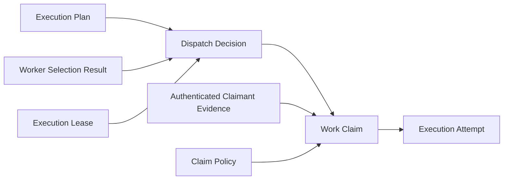

# ADR 0012: Work Claim Foundation

Status: Proposed

## Context

The [Runtime Architecture Baseline v1](../runtime/RUNTIME_ARCHITECTURE_BASELINE_V1.md)
requires one semantic owner for every authoritative transition and separates facts,
decisions, persisted intent, and external effects. The
[Runtime Component Map](../runtime/RUNTIME_COMPONENT_MAP.md) assigns Work Claim the
claimant, fence, version, expiry, release, and exclusive bounded-acceptance boundary.

ADR 0010 owns the `claim accepted` transition in Work Claim. ADR 0011 makes Work Claim
the exact downstream semantic consumer of an approved Dispatch Decision and makes
clear that Dispatch approval creates neither acceptance nor exclusivity. The current
architecture therefore establishes a distinct owner, but a future implementation
requires a precise definition of the claim generation, exclusivity key, fencing,
claimant evidence, expiry, release, concurrency, and reconstruction boundaries.

This ADR defines those boundaries as architecture documentation only. It authorizes
no implementation.

## Decision

Define Work Claim as the single semantic owner of:

> Whether one authenticated claimant may obtain exclusive, bounded acceptance of one
> dispatch-approved work item for one claim generation.

Work Claim owns:

- claimant identity reference;
- claim acceptance or rejection;
- the exclusivity boundary;
- claim generation;
- the authoritative fence;
- claim version;
- expiry evidence;
- release evidence;
- immutable claim history;
- scoped idempotency;
- expected-version concurrency; and
- deterministic reconstruction.

Work Claim does not own request semantics, plan interpretation, authorization, lease
creation or authority, readiness, ranking, selection, dispatch, queue transport,
execution start, attempt lifecycle, monitoring, completion, retry, scheduling,
orchestration, provider or model invocation, or external effects.

## Dependency direction

The relevant semantic dependency is:



The diagram records semantic dependencies, not a required service topology or global
transaction.

- Work Claim consumes an applicable approved Dispatch Decision directly.
- Work Claim does not independently consume Plan, Selection, Readiness, or Lease as
  new semantic inputs.
- Work Claim consumes authenticated claimant evidence from its owning identity and
  authentication boundary.
- Execution Attempt is the direct future semantic consumer of applicable Work Claim
  evidence.
- Queue Envelope may transport immutable references but owns no claim truth.
- No downstream evidence mutates a Dispatch Decision or earlier claim evidence.

## Authoritative inputs

One claim evaluation consumes only retained, immutable inputs:

- approved Dispatch Decision identity and canonical digest;
- organization and workload context;
- plan, work-item, and selected-candidate references retained by Dispatch;
- authenticated claimant evidence identity and canonical digest;
- claim-policy identity, version, and canonical digest;
- claim-generation boundary;
- claim evidence or history boundary;
- semantic claim-time evidence where expiry or applicability depends on time;
- clock or time-source identity and version where time is semantic;
- expected Work Claim stream version;
- caller-supplied scoped idempotency identity; and
- exact schema, serialization, component, and canonical-configuration versions.

Work Claim may verify identity, integrity, supported versions, organization and
workload scope, causality, freshness, and applicability. It must not recompute or
reinterpret authorization, readiness, selection, dispatch, identity, trust, health,
or lease authority.

## Dispatch dependency and upstream evidence

Work Claim resolves one retained Dispatch Decision and requires its outcome to be
approved and applicable at the retained claim boundary. The Dispatch artifact is the
canonical semantic input. Plan, work-item, selected-candidate, readiness, lease, and
causal authorization references are consumed transitively through that artifact.

For integrity and reconstruction, Work Claim may invoke or reproduce the exact
Dispatch reconstruction contract and verify that the Dispatch artifact and its
retained references remain canonical. It must not accept independently supplied
Plan, Selection, Readiness, or Lease evidence that could be combined with a different
Dispatch Decision. It must not re-evaluate Dispatch policy or replace Dispatch's
approval or denial.

This is the narrowest dependency that preserves deterministic reconstruction, scope
validation, and applicability without transferring ownership.

## Claimant identity boundary

Authenticated claimant evidence is an immutable artifact owned outside Work Claim.
It retains conceptually:

- claimant identity;
- authentication evidence identity and digest;
- organization and workload scope;
- selected-candidate identity or an explicit canonical equivalence reference;
- authentication boundary and effective-time evidence;
- schema and producer versions; and
- canonical content and digest.

Work Claim verifies that the evidence is supported, authentic, in scope, applicable
to the Dispatch offer, and canonically equivalent to the selected candidate. A
claimant mismatch is a deterministic rejection only when all evidence is otherwise
complete, visible, valid, and the exact claim policy defines that outcome.

Work Claim does not issue identity, authenticate a principal, establish trust or
readiness, authorize a workload, or grant execution authority. Possession of a
Dispatch reference, Queue Envelope, or credential is not claimant evidence.

## Exclusivity boundary and aggregate identity

The canonical Work Claim stream key is:

```text
organization_id
workload_context_id
plan_id
work_item_id
```

This key defines one authoritative work-item lineage containing every Work Claim
lifecycle transition for one immutable planned-work item. Claim generation,
candidate identity, claimant identity, Dispatch identity, authentication evidence,
policy version, and semantic effective-time evidence are canonical transition inputs
but are deliberately excluded from the stream key. Consequently:

- different claimants compete in one stream;
- approvals for different candidates compete in one stream;
- at most one active accepted claim exists for the work item and generation;
- generation creation, acceptance, rejection, expiry, release, supersession, and
  transition into a later generation are serialized in the same history;
- unrelated work items do not conflict;
- different organizations and workloads remain isolated; and
- a later claim cycle appends a later generation without changing stream identity or
  rewriting prior history.

The lineage stream is the sole authoritative exclusivity and CAS boundary. There is
no generation-owned stream, secondary generation counter, or cross-stream
coordination contract.

## Claim generation

A claim generation is the canonical boundary between one exclusive claim cycle and a
later re-claim cycle.

- The initial generation begins only when applicable approved Dispatch evidence and
  complete claimant and policy evidence are evaluated against an empty lineage and a
  first-generation event is accepted under expected-version CAS.
- An accepted generation remains current until immutable expiry or release evidence
  ends its applicability.
- Rejection does not create an active holder and does not itself advance generation.
- A later generation is permitted only when exact claim policy and retained history
  prove that the preceding accepted generation is expired or released.
- Creating a generation is an append to the existing work-item lineage. The append
  proves that no active applicable claim remains, the prior accepted generation ended
  through valid expiry or release evidence, policy permits re-claim, and the proposed
  generation is the unique next generation.
- Newer Dispatch evidence alone does not end an active generation or silently create
  a new one.
- A later generation retains the terminal evidence from the preceding generation as
  causation.
- Generation participates in canonical transition content, idempotency, fencing, and
  reconstruction, but never in stream identity.

Generation is a deterministic owner-assigned monotonic ordinal derived from committed
lineage history. The caller cannot select or advance it. Two writers proposing the
same next generation use the same lineage expected version, so at most one successor
is accepted; a loser reloads and recomputes. This ADR selects no database counter,
sequence, lock, or service.

## Fencing

Every accepted claim receives one authoritative fence. The fence protects downstream
consumers from stale holders after expiry, release, or later re-claim.

- Fences are monotonically ordered within the exclusive work-item lineage.
- A later accepted claim has a strictly newer fence.
- Equal or older fences cannot act as current.
- Execution Attempt and any future effect boundary retain and validate the claim
  identity, generation, and fence.
- Fence issuance belongs solely to Work Claim persistence and concurrency semantics.
- A fence is assigned atomically with accepted claim evidence.
- Rejection, expiry, and release do not advance, reduce, or reuse a fence.
- Timestamps, process order, persistence-return order, and last-write-wins never
  determine a fence.

The fence is the owner-assigned monotonic acceptance ordinal derived from committed
lineage history. Only an accepted transition advances the acceptance-fence ordinal.
Every lifecycle event advances lineage stream version, but rejection, expiry,
release, and generation creation do not become fences. A later accepted transition
receives the prior maximum fence plus one, regardless of generation. Replay derives
and verifies the same acceptance ordinal from immutable lineage history.

Lineage stream version, claim generation, and fence are distinct:

- lineage stream version orders every Work Claim lifecycle event;
- claim generation identifies one exclusive claim cycle within that lineage; and
- fence orders accepted claims across the complete lineage.

Event count is not accepted-claim count, generation is not stream identity, and
stream version is not a fence.

## Expiry

Exact versioned claim policy owns expiry rules. This ADR selects no duration.

- Claim acceptance retains semantic effective-time evidence.
- Expiry-dependent evaluation retains clock or time-source identity and version.
- `recorded_at` is evidence only and has no semantic authority.
- Replay never reads current time.
- Expiry does not mutate or erase acceptance.
- Expiry appends immutable evidence referencing the accepted claim and fence.
- An expired claim is no longer applicable to begin a new Execution Attempt.
- Expiry may permit a later generation only under exact claim policy and expected
  lineage version.

An expiry observation that is missing, unsupported, unverifiable, or based only on
ambient time fails closed and cannot advance generation.

## Release

Release is an explicit immutable transition that ends current claim applicability.

- The current authenticated claimant may request voluntary release.
- A separately authenticated administrative actor may release only when the exact
  claim policy explicitly grants that role and scope.
- Release evidence retains actor identity, authentication evidence, reason, semantic
  effective time, policy version, claim identity, generation, fence, and causation.
- Release appends new evidence and never deletes or rewrites acceptance.
- Release may permit a later generation under exact policy and expected lineage
  version.
- Release starts no execution and creates no authority or external effect.

No ambient administrator status, queue possession, timeout, execution result, or
mutable projection can release a claim.

## Outcomes and failures

Valid, complete, canonical evidence may produce these stable domain outcomes:

- accepted;
- rejected because the generation already has an active accepted claim;
- rejected because the claimant is not the selected candidate;
- rejected because the Dispatch Decision is not applicable;
- rejected under exact claim policy;
- expired; or
- released.

Expiry and release are later immutable transitions, not rewrites of the acceptance
outcome.

The following remain explicit failures rather than rejection:

- malformed input;
- missing or inaccessible evidence;
- unsupported schema, component, serialization, configuration, or policy version;
- digest or canonical-content mismatch;
- organization or workload scope mismatch;
- invalid causality or generation;
- idempotency conflict;
- expected-version conflict;
- persistence failure;
- reconstruction failure or divergence; and
- internal failure.

Only valid complete inputs reach claim-policy evaluation. A failure publishes no
claim outcome, fence, history entry, idempotency entry, or current pointer.

## Idempotency

The canonical Work Claim idempotency scope contains:

```text
organization_id
operation = claim_work
workload_context_id
plan_id
work_item_id
claim_generation
Dispatch Decision identity and digest
selected-candidate identity
claimant identity
authentication-evidence identity and digest
claim-policy identity, version, and digest
evidence or history boundary
semantic claim-time evidence
schema, component, serialization, and configuration versions
caller-supplied idempotency identity
```

Repeating the same scoped identity with identical canonical input returns the existing
immutable result and appends no duplicate evidence. Reusing it with different
canonical input fails explicitly and changes no history, fence, idempotency entry, or
current pointer.

A different claimant, Dispatch Decision, generation, policy, evidence boundary, or
semantic time is different canonical input and must not collapse into an earlier
claim. Equivalent retry must match the lineage identity, owner-resolved expected
generation, exact Dispatch and claimant evidence, policy, semantic time and evidence
boundary, and canonical content. A later generation requires a distinct canonical
input and idempotency identity. Idempotency cannot create or select a generation
outside the lineage CAS transition and grants no lease or execution authority.

## Concurrency

Every authoritative Work Claim lifecycle append supplies the expected version of the
same work-item lineage stream. This includes first-generation creation, claim
attempts, retained rejection, acceptance, expiry, release, and later-generation
creation.

- At most one writer for one expected version succeeds.
- Competing claimants and candidate-specific Dispatch approvals serialize within the
  same lineage and generation.
- At most one accepted claim becomes active in a generation.
- A stale writer appends nothing, reloads committed history, and recomputes.
- Equivalent retries converge through scoped idempotency.
- Conflicting immutable evidence fails explicitly rather than being merged.
- Two writers creating the same next generation race on one expected lineage version;
  one succeeds and the loser reloads the committed generation.
- Claim/release and claim/expiry races have one successor per expected version; the
  loser reloads and fails or recomputes against the resulting applicability state.
- Release/expiry races have one terminal successor; a stale incompatible terminal
  transition appends nothing.
- Later-generation creation racing with a late lifecycle append has one successor;
  generation creation remains invalid until committed history proves prior terminal
  evidence and no active applicable claim.
- A re-claim requires a valid later generation and strictly newer fence.
- Timestamp arbitration and last-write-wins are prohibited.
- No cross-generation, cross-stream, or cross-component atomicity is assumed or
  required.
- A current pointer may reference only committed immutable evidence.

## Immutable Work Claim evidence

Work Claim evidence conceptually retains:

```text
work_claim_id
organization_id
workload_context_id
plan_and_work_item_references
Dispatch_Decision_reference_and_digest
selected_candidate_reference
claimant_identity_reference
authentication_evidence_reference_and_digest
claim_policy_identity_version_and_digest
claim_generation
exclusive_boundary
fence
outcome_and_reason_codes
semantic_time_and_clock_evidence
expiry_or_release_evidence_where_applicable
canonical_input_digest
canonical_claim_digest
stream_identity_and_version
idempotency_identity
correlation_and_causation_references
reconstruction_metadata
recorded_at
schema_component_configuration_and_serialization_versions
```

These names are conceptual architectural vocabulary. They do not require Python
classes, APIs, database columns, tables, services, or infrastructure.

Accepted, rejected, expired, and released evidence is immutable and append-only.
Correction, cancellation, supersession, or compensation creates a new record
referencing retained history. No accepted claim is overwritten.

## Derived state

The following are derived and non-authoritative:

- current active claim;
- latest fence;
- current claimant;
- claim availability;
- indexes;
- dashboards;
- projections;
- caches; and
- lifecycle summaries.

Derived state must be reconstructable from immutable history. It cannot create a
missing claim, fence, generation, authority, or fact. No mutable authoritative
claim-status row is established.

## Determinism and reconstruction

Equivalent retained inputs under identical versions and history boundaries produce
identical outcome, reasons, generation, fence, canonical input, identity, canonical
claim content, and digest.

Reconstruction must:

1. load the complete work-item lineage history through the required version;
2. validate contiguous lineage stream versions;
3. resolve and reconstruct the exact approved Dispatch Decision;
4. verify claimant identity and authentication evidence;
5. resolve the exact claim policy and configuration;
6. verify retained semantic time, expiry, and release evidence;
7. replay generation creation, acceptance, rejection, expiry, release, and
   supersession rules;
8. reproduce every generation boundary, current and ended generation, accepted
   claimant, acceptance fence, current derived claim, and next permitted generation;
9. reproduce outcome, reasons, identity, canonical content, and digest; and
10. fail closed on skipped, duplicated, or non-monotonic generations; duplicate or
    non-monotonic fences; multiple accepted claims in one generation; a later
    generation before valid prior termination; lineage gaps; missing evidence;
    unsupported versions; invalid causality; or replay divergence without mutation.

Replay must not consult current queues, live workers, current projections, providers,
ambient configuration, current time, execution results, or external systems. Replay
performs no external effect and repairs no history.

## Execution Lease relationship

ADR 0011 makes Execution Lease the direct authority input to Dispatch. Work Claim
therefore accepts bounded responsibility under retained Dispatch evidence that
already references an applicable lease and causal Authorization Checkpoint evidence.

Work Claim verifies lease applicability transitively by reconstructing and validating
the exact Dispatch Decision. It does not accept Execution Lease as an independently
chosen claim input. It may resolve retained lease evidence only as part of Dispatch
reconstruction and only for integrity, scope, version, causality, and applicability.

Work Claim must not create, grant, renew, extend, revoke, replace, or transfer a
lease; reinterpret authorization; or treat claim acceptance as lease authority.
Execution Attempt independently requires applicable bounded authority in addition to
an applicable current claim.

## Downstream boundary

Execution Attempt is the direct future semantic consumer of Work Claim evidence. It
may require:

- an active applicable Work Claim;
- the current authoritative fence;
- applicable Execution Lease evidence;
- immutable work reference; and
- an explicit provider boundary.

Work Claim acceptance starts no execution, creates no Execution Attempt, invokes no
worker, publishes no queue message, creates no external effect, and grants no retry
or completion authority.

Queue Envelope may transport immutable references but owns no claim truth,
exclusivity, generation, fencing, or execution authority.

## Security and isolation

Every Work Claim artifact, stream identity, lineage boundary, and idempotency scope
carries organization and workload identity.

- Cross-organization or cross-workload claimant, Dispatch, or policy evidence fails
  closed.
- Evidence lookup is scoped before integrity or content details are exposed.
- Absent, foreign-organization, foreign-workload, and otherwise inaccessible evidence
  are externally indistinguishable.
- Failures do not disclose whether a foreign artifact exists or its owner, content,
  digest, version, or relationships.
- Same-scope visible evidence retains explicit integrity and version failures.
- Claimant evidence cannot be substituted across organization, workload, candidate,
  Dispatch, or generation scope.

No federation behavior is defined or authorized.

## Atomicity

One successful Work Claim append may atomically publish only:

- one immutable lineage event;
- updated lineage history;
- a repository-owned derived current pointer or index;
- generation assignment when the event creates a generation;
- fence assignment when the event accepts a claim; and
- the scoped idempotency index entry.

It must not atomically create or modify an Execution Lease, Queue Envelope, Execution
Attempt, Completion Evidence, or external effect. Failure before publication exposes
no partial event, generation, fence, history, idempotency entry, or pointer and
preserves prior accepted state. All permitted publications belong to the same Work
Claim owner and the same lineage commit.

Transaction co-location and shared storage do not transfer semantic ownership.
Cross-stream atomicity is neither assumed nor required.

## Overlap-stop rule

Work Claim must stop and return an explicit non-success rather than:

- re-authorizing a request;
- creating or changing lease authority;
- recomputing readiness or trust;
- selecting or reranking candidates;
- approving or denying Dispatch;
- treating queue possession as claim truth;
- starting or monitoring execution;
- choosing retry or completion;
- scheduling or orchestrating components;
- invoking a provider or model; or
- performing an external effect.

If proposed claim behavior requires one of these responsibilities, it belongs to
another owner or requires an amended or new ADR and another Architecture Review Gate.

## Alternatives considered

- **Embed claim acceptance in Dispatch:** rejected because offering work and granting
  exclusive bounded acceptance have different owners, aggregate keys, and races.
- **Use Execution Lease as the claim:** rejected because a lease owns bounded
  permission and authority applicability, not claimant acceptance or exclusivity.
- **Use one stream per generation:** rejected because separate generation streams
  cannot serialize generation admission or guarantee lineage-monotonic fences without
  hidden cross-stream atomicity.
- **Use candidate-specific claim streams:** rejected because approvals for different
  candidates must compete in one authoritative work-item lineage.
- **Use claimant-specific claim streams:** rejected because independent claimant
  streams could each accept the same exclusive work.
- **Use stream version directly as the acceptance fence:** rejected because generation
  creation, rejection, expiry, and release advance lineage version but must not
  advance or become an acceptance fence.
- **Coordinate generation through multiple streams:** rejected because generation
  creation, termination, and re-claim require one owner-scoped CAS boundary, not a
  cross-stream transaction.
- **Derive generation or fence from timestamps:** rejected because timestamps are
  evidence rather than authoritative ordering or concurrency control.
- **Use one mutable current-claim record:** rejected because it overwrites acceptance,
  expiry, and release history and prevents deterministic reconstruction.
- **Use Queue Envelope possession as claim truth:** rejected because transport and
  delivery metadata are not domain authority or exclusivity evidence.
- **Omit fencing:** rejected because a stale holder could act after expiry, release,
  or later re-claim.
- **Select the winner by timestamp:** rejected because timestamps are evidence, not
  concurrency control, and equal-time races would be nondeterministic.
- **Release by mutation:** rejected because release is new immutable evidence and
  prior acceptance remains historically true.
- **Create no Work Claim artifact:** rejected because exclusive acceptance would be
  implicit, unauditable, and incorrectly absorbed by Dispatch, Queue, Lease, or
  Execution.

## Consequences

Positive:

- exclusive acceptance has one narrow semantic owner;
- candidate-specific Dispatch approvals safely compete in one work-item generation;
- fencing protects downstream effects from stale holders;
- expiry and release remain immutable and reconstructable;
- authority, transport, and execution boundaries remain separate; and
- concurrency behavior is explicit without selecting infrastructure.

Costs:

- authenticated claimant evidence and exact claim policies must be retained;
- the Work Claim owner must serialize both generation admission and fence issuance;
- downstream consumers must validate claim generation and fence;
- semantic time and release evidence must remain reconstructable; and
- durable distributed persistence and effect integration require future decisions.

## Explicit non-goals

ADR 0012 does not define or authorize:

- Work Claim implementation;
- Execution Lease, Dispatch, Worker Identity, Worker Readiness, or Worker Selection
  changes;
- Queue Envelope implementation or queue publication or consumption;
- Execution Attempt or execution;
- monitoring, completion, retry, scheduling, or orchestration;
- provider or model invocation;
- public APIs, persistence technology, database schemas, migrations, or background
  workers;
- external effects;
- durable distributed persistence;
- implementation authorization; or
- any next milestone.

## Testable architectural invariants

1. Work Claim owns exclusive bounded acceptance only.
2. Work Claim consumes one applicable approved Dispatch Decision.
3. One authoritative lineage stream exists per organization, workload, plan, and work
   item.
4. Claim generation is immutable lineage event content, not stream identity.
5. Every lifecycle transition uses expected-version CAS on the lineage stream.
6. Only one unique next generation can be created, and an active generation must end
   through valid expiry or release before another begins.
7. At most one active accepted claim exists per exclusive work item and generation.
8. Competing claimants and candidate-specific offers serialize in one lineage.
9. Every accepted claim receives a lineage-monotonic fence.
10. Fence is distinct from lineage stream version and claim generation.
11. Rejection, expiry, and release cannot advance, reduce, or reuse a fence.
12. Claim acceptance grants no lease or execution authority.
13. Claim acceptance starts no execution and publishes no queue message.
14. Expiry and release append new evidence and never overwrite acceptance.
15. Equivalent retries return the same canonical result without duplicate history.
16. Conflicting idempotency reuse fails and changes no state.
17. Stale writers append nothing and cannot advance generation, pointer, or fence.
18. Reconstruction rejects generation, lineage-version, and fence divergence.
19. Derived current-claim state is reconstructable from immutable lineage history.
20. No cross-stream atomicity is required.
21. Replay uses no live state, current time, provider, or external system.
22. Absent and foreign evidence are externally indistinguishable.
23. Execution Attempt remains the direct downstream semantic consumer.
24. ADR 0012 preserves the ownership boundaries of ADRs 0007 through 0011.
25. ADR 0012 authorizes no implementation.

## Architecture review questions

1. Is Work Claim's owned decision singular and exact?
2. Is Dispatch Decision the correct direct upstream evidence?
3. Is one work-item lineage stream the correct exclusive owner?
4. Is generation correctly represented as immutable lineage content rather than
   stream identity?
5. Can only one unique next generation be created under lineage CAS?
6. Are lineage stream version, claim generation, and fence clearly distinct?
7. Are fences strictly monotonic across the complete work-item lineage?
8. Can rejection, expiry, or release interfere with fence derivation?
9. Are all claim, release, expiry, and re-claim races resolved in one lineage without
   cross-stream atomicity?
10. Is deterministic lineage reconstruction complete and fail-closed?
11. Are expiry and release append-only and reconstructable?
12. Is claimant evidence sufficiently authoritative without transferring identity,
   trust, or authorization ownership?
13. Are rejection and failure distinct?
14. Is the idempotency scope complete?
15. Does the Execution Lease relationship preserve ADR 0011?
16. Is Execution Attempt the correct downstream consumer?
17. Are absent and foreign evidence externally indistinguishable?
18. Does ADR 0012 preserve ADRs 0007 through 0011?
19. Does ADR 0012 authorize no implementation or next milestone?

## Governance and implementation gate

- ADR Status: **Proposed**.
- An Architecture Review Gate `PASS` is required before implementation authorization
  may be considered.
- Publication of this ADR does not authorize implementation.
- Merge of this ADR does not authorize implementation.
- A separate explicit Implementation Authorization is required after a gate `PASS`.
- Any material deviation requires an amended or new ADR and another Architecture
  Review Gate.
- A `FAIL` or unresolved ownership, dependency, claimant-evidence, generation,
  fencing, concurrency, reconstruction, security, or authority conflict blocks
  implementation.

No implementation, later runtime milestone, runtime behavior, or external effect is
authorized by this ADR.
