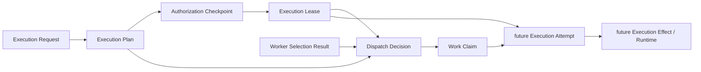

# ADR 0013: Execution Lease Foundation

Status: Proposed

## Context

[Runtime Architecture Baseline v1](../runtime/RUNTIME_ARCHITECTURE_BASELINE_V1.md)
requires one semantic owner for every authoritative fact and decision, immutable
history, deterministic reconstruction, explicit concurrency, and dependencies only
on preceding authoritative artifacts. The
[Runtime Component Map](../runtime/RUNTIME_COMPONENT_MAP.md) assigns Execution Lease
bounded permission, scope, expiry, and revocation reference. The
[Runtime Dependency Rules](../runtime/RUNTIME_DEPENDENCY_RULES.md) place it after
Authorization Checkpoint and before Dispatch and execution.

ADR 0010 defines the conceptual `lease granted` transition. ADR 0011 makes
Execution Lease the direct authority input to Dispatch Decision while preserving
Authorization Checkpoint as the authority owner. ADR 0012 makes Work Claim consume
lease applicability only transitively through Dispatch and requires a future
Execution Attempt to validate both an applicable claim and bounded authority.

The current runtime contains Dispatch-owned retained lease-shaped evidence used to
verify the existing Dispatch boundary. It does not contain an independent Execution
Lease semantic owner, lifecycle stream, or implementation. Before any such
implementation can be considered, the architecture must define lease causality,
lineage, generation, permissions, time, lifecycle events, concurrency,
reconstruction, and downstream evidence contracts without absorbing Authorization,
Dispatch, Work Claim, or execution responsibilities.

This ADR is architecture documentation only. It grants no implementation authority.

## Decision

Define Execution Lease as the single semantic owner of:

> The immutable lifecycle representation of retained, bounded execution authority
> previously granted for one exact organization, workload context, plan, work item,
> and permission lineage.

Execution Lease owns the representation and lifecycle of that retained authority,
including:

- lease and event identities;
- authoritative lease lineage;
- owner-assigned lease generation and lineage version;
- exact bounded permission and scope;
- effective and expiry boundaries;
- renewal, revocation, and supersession evidence;
- canonical content and digests;
- immutable append-only history; and
- deterministic reconstruction.

Execution Lease does not originate authorization. Authorization Checkpoint remains
the semantic owner of whether an authenticated principal may request a planned
action. A lease only materializes and governs the bounded lifecycle of authority
already granted by exact retained Authorization Checkpoint evidence.

## Non-owned decisions

Execution Lease does not own or decide:

- authentication, identity issuance, principal identity, or trust;
- authorization policy or Authorization Checkpoint approval or denial;
- Execution Request or Execution Plan semantics;
- Worker Identity, Attestation, Runtime Health, Readiness, or Selection;
- Dispatch approval or denial;
- Work Claim acceptance, generation, exclusivity, or fencing;
- Execution Attempt admission or attempt lifecycle;
- Retry Policy or Queue Envelope transport;
- provider or model invocation or any execution effect;
- Monitoring, Completion & Outcome, or business outcomes; or
- scheduling, orchestration, or external effects.

If proposed lease behavior requires one of these decisions, the Overlap-Stop Rule
requires the work to stop and return to the owning component or a new architecture
review.

## Dependency direction

The relevant partial order is:



The graph records semantic evidence dependencies, not a deployment topology or
cross-owner transaction.

- Authorization Checkpoint never depends on Execution Lease.
- Execution Lease consumes no Dispatch, Claim, Attempt, or later runtime evidence.
- Dispatch consumes applicable lease evidence directly and never mutates it.
- Work Claim consumes lease applicability transitively through Dispatch.
- A future Execution Attempt may consume an exact lease generation directly.
- No downstream observation rewrites earlier authorization or lease history.

## Authorization Checkpoint causality

Lease creation requires immutable authoritative Authorization Checkpoint evidence.
The retained causal chain must be sufficient to reconstruct and verify:

- authorization decision identity, canonical digest, and version;
- organization, workload, plan, work-item, and principal scope;
- granted capabilities or permissions;
- semantic evaluation boundary;
- governing authorization policy identity, version, and digest where applicable;
- schema, component, serialization, and configuration versions; and
- correlation and causation references.

A lease must never exceed the authorization scope, invent permissions, broaden
authority during renewal, or reinterpret an upstream approval. Missing,
inaccessible, denied, malformed, unsupported, expired where applicable, or
scope-inconsistent authorization evidence fails closed and publishes no lease event.

Broader work scope or permissions require new authoritative Authorization
Checkpoint evidence. Transaction co-location, a shared identifier, or possession of
authorization evidence does not transfer authorization ownership to Execution Lease.

## Authoritative lease lineage

The canonical lease lineage key is:

```text
organization_id
workload_context_id
plan_id
work_item_id
permission_family
```

The `permission_family` is the narrow versioned capability family governed by the
lineage. It prevents unrelated permissions from sharing lifecycle state while
preserving one serialization boundary for renewals, revocations, and supersession of
the same bounded authority.

Every lifecycle event for this key serializes through one authoritative
expected-version compare-and-swap boundary. Generation is event content, not part of
the stream key. There is no hidden cross-stream or cross-owner atomicity.

## Lease identity, generation, lineage version, and event identity

These values are distinct:

- **Lease identity** identifies one immutable retained lease generation.
- **Generation** is an owner-assigned positive monotonic number within one lineage.
- **Lineage version** orders every immutable lifecycle event in the lineage.
- **Event identity** identifies one specific immutable grant, renewal, revocation, or
  supersession event.

Every successful append advances lineage version exactly once. A stale expected
version appends nothing and advances no identity, generation, pointer, or idempotency
entry.

The owner assigns a new generation only when committed history permits a genuinely
new bounded authority instance, including an initial grant or a later grant after an
earlier generation is no longer applicable under retained evidence. A caller cannot
choose an authoritative generation value.

Renewal is a lifecycle event for the same lease generation when it continues the
same organization, workload, plan, work item, and permission authority under fresh
authoritative evidence. Renewal advances lineage version but not generation. A
change in lineage scope, permission family, or authority requiring a new bounded
instance is not renewal. Supersession may establish a later generation while
preserving the earlier generation and its full history.

## Permission model

Lease permissions are exact bounded capabilities. The initial vocabulary is:

- `OFFER_WORK_ITEM`: permits Dispatch to evaluate whether the exact work item may be
  offered to a retained selected candidate.
- `INITIATE_WORK_ITEM_EXECUTION`: permits a future Execution Attempt or effect
  boundary to evaluate initiation for the exact work item, subject to every other
  required authority and claim precondition.

These permissions are independent. Possessing one does not imply the other, and
possessing a lease does not imply generic execution authority. A lease may narrow
upstream authority but cannot widen it. New permission names or implication rules
require versioned architecture and policy review; implementations must not infer
them from strings or ambient configuration.

## Semantic time and expiry

Authority applicability uses retained semantic-time evidence. The architecture
distinguishes:

- `effective_at`: inclusive beginning of authority applicability;
- `expires_at`: exclusive end of authority applicability;
- renewal, revocation, and supersession semantic boundaries;
- downstream `evaluation_time` supplied as immutable evaluation evidence; and
- `recorded_at`, a diagnostic persistence timestamp with no authority.

For a generation that is otherwise applicable, the time predicate is the half-open
interval:

```text
effective_at <= evaluation_time < expires_at
```

Expiry is deterministically derived from retained effective and expiry evidence. It
does not require a mutable timer-driven transition. An implementation may later
retain an expiry observation event for operational purposes only if a governing
decision defines it; the passage of current wall-clock time cannot mutate history or
be consulted during replay.

Clock or time-source identity and version must be retained wherever semantic time
affects a decision. `recorded_at` cannot establish ordering, resolve a race, extend
authority, or become the evaluation boundary.

## Grant and renewal

A grant appends immutable evidence for a new owner-assigned generation after
verifying exact Authorization Checkpoint causality, scope, permission, policy,
semantic time, expected lineage version, and idempotency.

A renewal:

- appends immutable evidence to the same generation;
- requires fresh, exact authoritative authorization evidence;
- preserves all earlier authority facts and lineage history;
- remains within the same lineage and upstream scope;
- may continue or narrow permissions but never broaden them;
- retains its own effective, expiry, policy, and causation evidence; and
- obeys the same CAS, idempotency, atomicity, isolation, and replay rules as grant.

Renewal cannot change organization, workload, plan, work item, or permission family.
It cannot silently revive a revoked or superseded generation. Any authority not
proved by the retained renewal evidence requires a new Authorization Checkpoint
decision and, where the lineage rules permit, a new generation.

Concrete maximum lease duration and renewal-window policy remain versioned policy
choices for later governance and implementation authorization.

## Revocation

Revocation is an immutable lineage event that ends applicability at an exact retained
semantic boundary. It requires retained evidence from an authority recognized by an
exact versioned revocation policy, scoped to the same organization, workload, plan,
work item, permission family, and lease generation.

Revocation:

- appends under expected-version CAS;
- retains the revocation directive identity, digest, authority, policy, reason, and
  semantic boundary;
- preserves the historical fact and interval in which the lease existed;
- never deletes or rewrites grant or renewal evidence; and
- makes downstream applicability deterministic for evaluations at or after the
  revocation boundary.

The concrete upstream revocation-directive contract and authorized issuer model
remain later governance work. Until defined, an implementation must not invent a
revocation authority. Cross-owner races between revocation, future attempt
admission, and future effect initiation are intentionally not resolved here; this
ADR only defines the immutable lease evidence those owners may consume.

## Supersession

Supersession is an immutable event establishing that an exact earlier generation is
no longer the applicable generation at a retained semantic and history boundary. A
later owner-assigned generation may follow only when committed lineage history and
versioned policy permit it.

Supersession never rewrites or deletes the earlier generation. Downstream consumers
must retain the exact lease identity, generation, canonical digest, and lineage
version or history boundary they evaluated. Replay must not substitute a mutable
`current lease` projection or a newer generation for retained evidence.

Whether a post-revocation grant must be represented as a later generation and the
precise admission rules for later grants remain versioned policy questions. They
cannot be resolved by timestamps or a caller-authored generation.

## Dispatch Decision relationship

Dispatch Decision is a direct semantic consumer of Execution Lease evidence under
ADR 0011. Dispatch may verify only:

- lease identity, generation, lineage boundary, and canonical digest;
- organization, workload, plan, and work-item scope;
- exact `OFFER_WORK_ITEM` permission;
- effective and expiry applicability at Dispatch's retained evaluation time;
- retained revocation and supersession boundaries;
- supported lease and policy versions; and
- Authorization Checkpoint causal integrity.

Dispatch must not issue, renew, revoke, supersede, or transfer a lease; reinterpret
authorization; or use a mutable lease projection as authority. A valid applicable
lease permits only Dispatch evaluation. It does not predetermine approval, create a
claim, or perform an external effect.

ADR 0011 remains controlling for Dispatch ownership and its complete evaluation.

## Work Claim relationship

Work Claim consumes an approved Dispatch Decision directly. Lease evidence is
therefore transitive through the exact retained Dispatch causal chain. Work Claim
may resolve that lease evidence only to verify Dispatch reconstruction, integrity,
scope, version, causality, and applicability as defined by ADR 0012.

Work Claim does not choose, interpret, grant, renew, revoke, or supersede lease
authority. Claim acceptance grants no lease authority, and lease possession grants
no claim acceptance, exclusivity, generation, or fence. ADR 0012 remains controlling
for Work Claim ownership.

## Future Execution Attempt contract

A future Execution Attempt owner may consume the following immutable lease evidence
without assuming lease ownership:

- exact lease and event identities and canonical digests;
- lineage identity, generation, and lineage/history version;
- organization and workload scope;
- plan and work-item applicability;
- exact `INITIATE_WORK_ITEM_EXECUTION` permission;
- effective and expiry evidence evaluated at an explicit retained semantic time;
- renewal, revocation, and supersession evidence through the consumed boundary;
- Authorization Checkpoint identity, digest, version, scope, and causality;
- policy identity, version, and digest; and
- schema, component, serialization, and configuration versions.

This is an input contract only. ADR 0013 does not define attempt identity, admission,
lifecycle, provider boundaries, effects, results, monitoring, completion, or retry.
Because this decision occupies ADR 0013, a future Execution Attempt ADR must use the
next available ADR number.

## Future Execution Effect or runtime contract

A future effect or runtime owner may consume the exact retained lease generation and
history boundary required by its own separately governed admission contract. It may
verify integrity, scope, exact permission, temporal applicability, revocation, and
supersession without mutating or reinterpreting the lease.

This ADR does not define or authorize an Execution Effect owner, provider call,
external side effect, queue, or runtime. In particular, it does not decide whether
attempt admission freezes authority for a later effect. The cross-owner semantic
race between attempt admission, lease revocation, and effect initiation requires a
future architecture resolution before external effects are authorized.

## Owner-scoped idempotency

The canonical idempotency scope binds, as applicable:

```text
organization_id
workload_context_id
operation
lease_lineage_key
authorization identity, digest, and version
plan_id
work_item_id
permission and permission family
owner-resolved generation
prior lease event and history boundary
semantic-time boundaries
lease-policy identity, version, and digest
schema, component, serialization, and configuration versions
caller-supplied idempotency identity
```

Equivalent retries with identical canonical authoritative input converge on the
existing immutable result and append no duplicate event. Reusing the same scoped
identity with different canonical input fails explicitly and changes no history,
generation, lineage version, derived pointer, or idempotency entry.

Different authorization, permission, scope, generation, semantic-time, policy, or
history input cannot collapse into an earlier operation. Idempotency cannot choose a
generation, repair history, bypass CAS, or grant authority.

## Concurrency

Every grant, renewal, revocation, and supersession append supplies the expected
version of the same authoritative lease lineage.

- Exactly one successor may commit for one expected lineage version.
- Concurrent initial grants or later-generation grants serialize in one lineage.
- Renewal/renewal, renewal/revocation, renewal/expiry-applicability, revocation,
  supersession, and stale-writer races are resolved by the committed successor.
- A stale writer appends nothing, reloads committed history, and recomputes against
  the new boundary.
- An equivalent retry converges through scoped idempotency.
- A conflicting retry fails explicitly without mutation.
- Timestamps never arbitrate races and last-write-wins is prohibited.
- No lease transition assumes a transaction with Authorization, Dispatch, Claim,
  Attempt, Queue, provider, Monitoring, Completion, or an external system.

Expiry derived from retained time is an applicability predicate, not a competing
timestamp write. If a later policy permits a retained expiry event, it must still
serialize under the same lineage CAS and must not make wall-clock arrival order
authoritative.

## Atomic publication

One successful owner-scoped lease append may atomically publish only:

- one immutable lease lifecycle event;
- updated immutable lineage history;
- lease identity and event indexes;
- a repository-owned derived lineage pointer or index;
- owner-assigned generation and lineage-version state; and
- the scoped idempotency entry.

Failure before commit exposes no partial lease event, history, generation, version,
index, pointer, or idempotency state and preserves the prior committed lineage.

The lease boundary must not atomically create or modify Authorization Checkpoint,
Dispatch Decision, Work Claim, Execution Attempt, Queue Envelope, a provider,
Monitoring, Completion, or an external system. Shared persistence does not transfer
semantic ownership. Cross-stream and cross-owner atomicity are not assumed.

## Immutable lease evidence

An immutable lease artifact or lifecycle event conceptually retains, as applicable:

```text
lease_id
lease_event_id
lease_lineage_key
lease_generation
lineage_version
organization_id
workload_context_id
plan_id
work_item_id
permission_family
exact_permissions
authorization_checkpoint_identity_digest_and_version
authorization_scope_and_policy_reference
effective_at_and_expires_at
renewal_revocation_and_supersession_evidence
lease_policy_identity_version_and_digest
canonical_input_digest
canonical_lease_or_event_digest
idempotency_identity
correlation_and_causation_references
reconstruction_metadata
recorded_at
schema_component_serialization_and_configuration_versions
```

These are conceptual architectural fields. This ADR specifies no Python class,
database table, API route, migration, persistence product, or wire protocol.

## Domain events and failures

Legitimate immutable lifecycle events include conceptually:

- lease granted;
- lease renewed;
- lease revoked; and
- lease superseded.

Expiry is derived from retained semantic-time evidence rather than automatically
being a mutable timer-driven event. A denial at Authorization Checkpoint is not a
lease event, and an integrity or persistence failure is never converted into a
successful domain event.

Explicit failures include:

- missing or inaccessible authorization or lease evidence;
- foreign organization or workload scope;
- digest, canonical-content, or causality mismatch;
- unsupported schema, component, serialization, configuration, policy, or
  permission version;
- invalid or broadened permission or scope;
- invalid semantic-time interval;
- stale expected version or CAS conflict;
- illegal grant, renewal, revocation, or supersession;
- idempotency conflict;
- persistence or atomic-publication failure;
- reconstruction failure or divergence; and
- internal failure.

Failure publishes no lifecycle event or partial repository state.

## Derived state

Current applicability, latest generation, latest lease, remaining duration, current
permissions, indexes, dashboards, projections, caches, and lifecycle summaries are
derived and non-authoritative. They must be rebuildable from retained immutable
history and cannot create authority, fill missing evidence, repair history, or
replace an exact consumed boundary.

## Deterministic reconstruction

Reconstruction receives:

- complete lease lineage history through an explicit version;
- exact Authorization Checkpoint evidence and governing policy where applicable;
- exact lease policy, permission, and scope;
- effective, expiry, renewal, revocation, and supersession evidence;
- schema, component, serialization, and configuration versions; and
- canonical inputs, content, identities, and digests.

It must:

1. validate contiguous lineage versions and event causality;
2. reconstruct exact upstream authorization evidence without re-authorizing;
3. reproduce every owner-assigned generation and lifecycle transition;
4. reproduce applicability at an explicit retained semantic evaluation time;
5. reproduce lease and event identities, canonical content, and digests;
6. reproduce owner-derived indexes or current pointers when requested; and
7. fail closed on a gap, duplicate, unsupported version, invalid scope or permission,
   illegal transition, non-monotonic generation, invalid time boundary, digest
   mismatch, or divergence without mutation.

Replay must not consult current wall-clock time, mutable authorization or lease
projections as authority, queues, live workers, providers, execution state,
Monitoring, Completion, ambient configuration, or external systems. It performs no
external effect and repairs no history.

## Security and isolation

Every lease artifact, lineage key, history boundary, lookup, and idempotency scope
carries organization and workload identity.

- Authorization, plan, work-item, policy, and downstream evidence must match exact
  organization and workload scope.
- Permission is narrowed to the exact retained upstream grant.
- Evidence lookup is owner-scoped before integrity or content details are exposed.
- Absent, foreign-organization, foreign-workload, and otherwise inaccessible
  evidence are externally indistinguishable where required by the existing
  isolation policy.
- Failures must not disclose whether a foreign artifact exists or reveal its owner,
  content, digest, version, permission, time boundary, or relationships.
- Same-scope visible evidence retains explicit integrity and version failures.
- Canonical lease evidence must not retain credentials, secrets, tokens, private
  keys, or reusable authentication material.
- No federation or cross-organization authority transfer is defined.

Immutable retained references support audit reconstruction but grant no authority
beyond their exact scope and permission.

## ADR 0010 compatibility

ADR 0010 already assigns Execution Lease bounded execution permission, scope,
expiry, and revocation reference; places it after Authorization Checkpoint; and
separates it from Dispatch, claims, execution, retry, and completion. ADR 0013 makes
that existing conceptual boundary precise and introduces no direct contradiction.
ADR 0010 therefore requires no amendment merely because this ADR formalizes the
Execution Lease Foundation.

ADR 0010's future Execution Attempt and Completion boundary may require separate
clarification before effect-bearing execution work. That remains future governance
and does not expand this PR.

## Alternatives considered

- **Let Authorization Checkpoint own leases:** rejected because originating an
  authorization decision and governing the retained bounded lifecycle of that
  decision are distinct semantic decisions and concurrency boundaries.
- **Let Dispatch own leases:** rejected because Dispatch owns one offer approval or
  denial and must remain a downstream consumer of authority.
- **Use Work Claim as authority:** rejected because claims own exclusive bounded
  acceptance and fencing, not permission or authorization applicability.
- **Use one mutable current-lease row:** rejected because renewal, revocation, and
  supersession history would be overwritten and replay would be incomplete.
- **Use generation as stream identity:** rejected because lifecycle transitions and
  admission of a later generation must serialize in one lineage.
- **Use timestamps for generation or concurrency:** rejected because semantic time is
  evidence, not an ordering lock or CAS substitute.
- **Treat expiry as a required timer write:** rejected because applicability is
  deterministic from retained half-open time boundaries.
- **Treat attempt admission as permanently freezing authority:** rejected because the
  revocation/effect race belongs to future cross-owner architecture.
- **Create no distinct Execution Lease owner:** rejected because bounded retained
  authority lifecycle would otherwise overlap Authorization, Dispatch, Claim, or
  execution and lack one reconstructable owner.

## Consequences

Positive:

- retained bounded authority has one narrow semantic owner;
- Authorization Checkpoint remains the origin of authorization;
- Dispatch and future execution consumers receive exact immutable authority
  evidence;
- renewal, revocation, supersession, time, CAS, and replay behavior are explicit;
- immutable history supports deterministic audit reconstruction; and
- no persistence technology or downstream runtime implementation is selected.

Costs:

- exact Authorization Checkpoint, policy, semantic-time, and lifecycle evidence must
  remain available;
- callers and consumers must distinguish identity, generation, lineage version, and
  event identity;
- downstream consumers must retain the exact generation and history boundary used;
- revocation authority and effect-initiation races require later governance; and
- durable distributed persistence requires a separate implementation decision.

## Explicit non-goals

ADR 0013 does not define or authorize:

- Execution Lease implementation;
- Execution Attempt or Execution Effect implementation or design;
- Authorization Checkpoint, Dispatch, Work Claim, Worker Selection, Worker
  Readiness, or Execution Plan changes;
- Queue Envelope, retry, execution, Monitoring, Completion & Outcome, scheduling, or
  orchestration;
- provider or model invocation, background workers, APIs, migrations, or external
  effects;
- database schemas, persistence technology, or durable distributed persistence;
- implementation authorization; or
- any next milestone.

## Testable architectural invariants

1. Execution Lease owns only the immutable lifecycle representation of retained,
   bounded authority.
2. Authorization Checkpoint remains the sole origin of authorization decisions.
3. Every lease generation retains exact immutable Authorization Checkpoint causality.
4. A lease never expands authorization scope or permission.
5. One lineage exists per organization, workload, plan, work item, and permission
   family.
6. Generation is owner-assigned monotonic event content, not stream identity.
7. Lease identity, generation, lineage version, and event identity remain distinct.
8. Every lifecycle transition uses expected-version CAS on the same lineage.
9. One successful append advances lineage version exactly once; stale writers append
   nothing.
10. Permissions are exact bounded capabilities with no implicit generic authority.
11. Applicability uses retained half-open semantic-time boundaries.
12. Current wall-clock time and recorded timestamps are not replay authority.
13. Renewal remains within exact upstream scope and the same generation.
14. Revocation and supersession append evidence and never rewrite earlier history.
15. Dispatch consumes applicable `OFFER_WORK_ITEM` lease evidence directly.
16. Work Claim consumes lease applicability only transitively through Dispatch.
17. A future Execution Attempt may consume exact
    `INITIATE_WORK_ITEM_EXECUTION` evidence without owning the lease.
18. Lease possession creates no Dispatch approval, claim, attempt, or external
    effect.
19. Equivalent retries converge and conflicting idempotency reuse fails explicitly.
20. Atomic publication is limited to one owner and one lineage commit.
21. Reconstruction uses retained evidence only and fails closed on divergence.
22. Absent and foreign evidence are externally indistinguishable where required.
23. Canonical evidence contains no credentials or secret material.
24. ADRs 0007 through 0012 remain controlling for their existing owners.
25. ADR 0013 grants no implementation authority or later milestone.

## Architecture review questions

1. Is the retained bounded-authority lifecycle one exact semantic owner?
2. Does Authorization Checkpoint remain the sole authorization decision owner?
3. Is the lineage key sufficient and free of downstream identity?
4. Are generation, lineage version, lease identity, and event identity distinct?
5. Are `OFFER_WORK_ITEM` and `INITIATE_WORK_ITEM_EXECUTION` sufficiently bounded?
6. Are renewal, revocation, and supersession append-only and reconstructable?
7. Does half-open retained-time applicability avoid wall-clock replay?
8. Is owner-scoped idempotency complete for every lifecycle operation?
9. Do all races resolve through one expected-version CAS boundary?
10. Is atomic publication limited to owner-scoped lease state?
11. Does deterministic reconstruction fail closed without live dependencies?
12. Are organization, workload, scope, and foreign-evidence isolation preserved?
13. Does Dispatch remain a direct consumer without taking lease ownership?
14. Does Work Claim retain only its transitive relationship through Dispatch?
15. Is the future Execution Attempt input contract bounded without designing it?
16. Is the attempt-admission/effect-initiation revocation race correctly deferred?
17. Does ADR 0010 require no present amendment?
18. Do ADRs 0007 through 0012 remain controlling?
19. Does ADR 0013 authorize no implementation or next milestone?

## Governance and implementation gate

- ADR Status: **Proposed**.
- An Architecture Review Gate `PASS` is required before implementation authorization
  may be considered.
- Publication or merge of this ADR does not authorize implementation.
- A separate explicit Implementation Authorization is required after a gate `PASS`.
- Any material deviation requires an amended or new ADR and another Architecture
  Review Gate.
- A `FAIL` or unresolved ownership, authorization-causality, lineage, permission,
  time, renewal, revocation, supersession, concurrency, reconstruction, security, or
  effect-boundary conflict blocks implementation.

No Execution Lease implementation, Execution Attempt, Execution Effect, Retry,
Monitoring, Completion, later runtime milestone, runtime behavior, or external
effect is authorized by this ADR.
