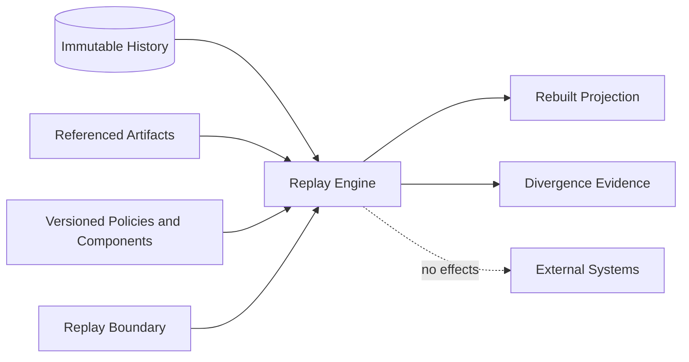

# Immutable History and Replay

## Append-only history

Authoritative events are never updated or deleted. Correction, revocation,
cancellation, compensation, and supersession are new events referencing retained
history.

A conceptual event envelope retains:

```text
eventId                 eventType
eventSchemaVersion      streamType
streamId                streamVersion
organizationId          workloadContextId
causationId             correlationId
idempotencyKey          producer
producerVersion         evidenceReferences
payload                 payloadHash
recordedAt              effectiveAt
```

These fields define evidence requirements, not a required storage schema.

## Ordering

Within a stream, `(streamId, streamVersion)` is authoritative. Timestamps are
evidence, not tie-breakers. No global total order is assumed. Cross-stream causality
uses explicit references.

## Canonical identity and serialization

Artifact identities derive from an explicit namespace, artifact and schema type,
organization, workload context, and canonical semantic inputs. Canonical payloads
use UTF-8, stable field names, sorted map keys, defined list ordering, normalized
timestamps and enums, deterministic decimals, and no NaN or infinity.

Identity must not depend on process or host identity, random generation, memory
address, local path, wall-clock timing, locale, or unordered enumeration.

## Replay contract

Replay inputs are immutable history and referenced artifacts, exact policies,
schemas, component versions, canonical configuration, and explicit stream-version
boundaries.

Replay outputs include reconstructed derived state, processed version boundaries,
configuration and result hashes, and any divergence or missing-evidence findings.



Identical replay inputs must yield identical ordering, reason codes, serialization,
and hashes. Replay never calls live providers, reads current queues or health, uses
current time, repairs history, or repeats an external effect.

Replay fails closed on version gaps, invalid hashes or causal references, missing or
unsupported evidence, or output divergence. Failure does not alter history.
