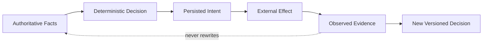

# Runtime Component Map

> All names in this document are conceptual contracts, not required classes,
> services, endpoints, or database tables.

Each authoritative fact or decision has one semantic owner. “Must never own” is as
important as the positive responsibility.

| Component | Owns | Must never own |
| --- | --- | --- |
| Request Intake | Receipt, transport identity, idempotency capture, canonical request provenance | Business validation, authorization, planning, worker state, execution |
| Request Validation | Structural and semantic validation findings | Caller authority, plans, worker state, execution |
| Execution Planning | Deterministic workload decomposition, capabilities, resources, work-unit dependencies | Authorization, worker availability, selection, dispatch, retries |
| Authorization Checkpoint | Whether a principal may request a specific planned action under referenced policy | Identity issuance, worker trust, readiness, selection, execution |
| Execution Lease (future) | Bounded permission, scope, expiry, revocation reference | Authorization policy, selection, execution results |
| Queue Envelope (future) | Transport representation, delivery metadata, immutable references | Workload semantics, authorization truth, claims, execution truth |
| Worker Identity (future) | Stable worker identity and organization association | Attestation, health, readiness, selection |
| Worker Attestation (future) | Trust-verification evidence and outcome | Identity, health, authorization, selection |
| Worker Runtime Health (future) | Time-bounded operational observations | Trust, authorization, readiness ownership, selection |
| Worker Readiness (future) | Contextual eligibility and reasoned evidence references | Underlying facts, ordering, dispatch, claims, execution |
| Worker Selection (future) | Explainable candidate ordering | Readiness, authority, scheduling, dispatch, claims, leases, execution, retries |
| Dispatch Decision (future) | Decision to offer a work item to a selected candidate | Ranking, claims, execution |
| Work Claim (future) | Claimant, fence, version, expiry, release | Authorization, selection, execution result |
| Work Execution (future) | Attempt identity, attempt-local lifecycle, effect and result evidence | Readiness, selection, claim policy, retry policy, completion adjudication |
| Execution Monitoring (future) | Progress and liveness observations | Attempt ownership, retry decision, completion truth |
| Completion (future) | Terminal adjudication and reason | Output generation, retry policy, worker lifecycle |
| Retry Policy (future) | Whether another attempt may be proposed and within what budget | Historical mutation, selection, execution |
| Runtime History | Append-only event streams, stream versions, concurrency enforcement | Domain decisions, authority, external effects |
| Replay Engine | Reconstruction, divergence detection, replay diagnostics | Live calls, history repair, external effects |
| Current-State Projection | Disposable query views and current pointers | Historical truth, authority, facts absent from history |

## Fact, decision, and effect separation

Later evidence can trigger a new decision. It cannot mutate an earlier fact or
decision.
