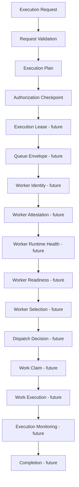

# Runtime Lifecycle

> Artifact names are conceptual architectural vocabulary. v0.7A implements none of
> these runtime stages.

## Dependency flow

## Stage rules

1. **Request entry:** canonicalize provenance and idempotency. Reusing an idempotency
   key with different content fails.
2. **Validation:** record deterministic findings. A corrected request is a new
   version or identity; prior failure is not overwritten.
3. **Planning:** use validated inputs and versioned planning policy only. Plans do
   not depend on available workers or execution state.
4. **Authorization:** decide bounded authority without dispatching or executing.
5. **Worker evidence:** identity, attestation, health, and readiness remain distinct.
6. **Selection:** future ordering only; it performs no effect.
7. **Dispatch and claim:** future decisions with their own owners and concurrency
   boundaries.
8. **Execution:** future effectful work only after required authority and claim.
9. **Completion:** separate terminal adjudication; output alone does not prove it.
10. **Persistence:** commit authoritative transitions before exposing committed
    state or beginning an effect.
11. **Replay:** reconstruct without repeating external effects.

## Historical direction

Downstream evidence may inform a new upstream evaluation but may not mutate the
historical artifact that preceded it.
