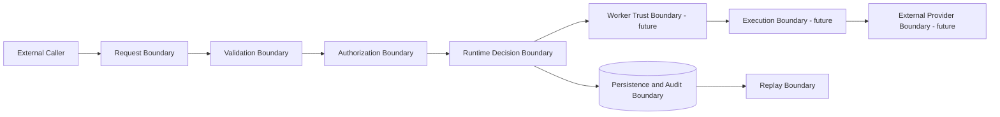

# Runtime Security Boundaries

## Trust zones

Crossing a trust zone requires an explicit validated artifact. Transport possession
does not establish semantic authority.

## Separation requirements

- Authentication identifies a principal; it does not authorize a workload.
- Worker Identity identifies a worker; it does not prove trust, health, or readiness.
- Attestation records trust verification; it does not prove current health.
- Health records operational evidence; it does not prove authorization or trust.
- Readiness derives contextual eligibility; it does not rank or dispatch.
- Selection orders candidates; it does not authorize or reserve them.
- Leases and claims cannot expand upstream authority.

## Organization isolation

Every protected artifact carries organization scope, and organization identity is
part of canonical identity and idempotency scope. Cross-organization references are
forbidden without a future, explicitly approved federation contract.

## Prohibited access

A runtime component must not:

- inspect credentials outside the authentication or authorization boundary;
- infer planning truth from a queue payload;
- consume execution output during readiness or selection;
- use live worker health during replay unless retained as referenced evidence;
- mutate identity, attestation, health, or readiness from a downstream layer;
- treat a lease or claim as proof of identity or trust;
- rewrite an earlier decision from completion evidence;
- call providers from planning, readiness, or selection; or
- expose another organization’s artifact existence through error details.

Authorization decisions fail closed and remain owned by the Authorization Checkpoint.
Downstream validation can verify scope, integrity, version, expiry, and applicability
but cannot create or extend authority.
